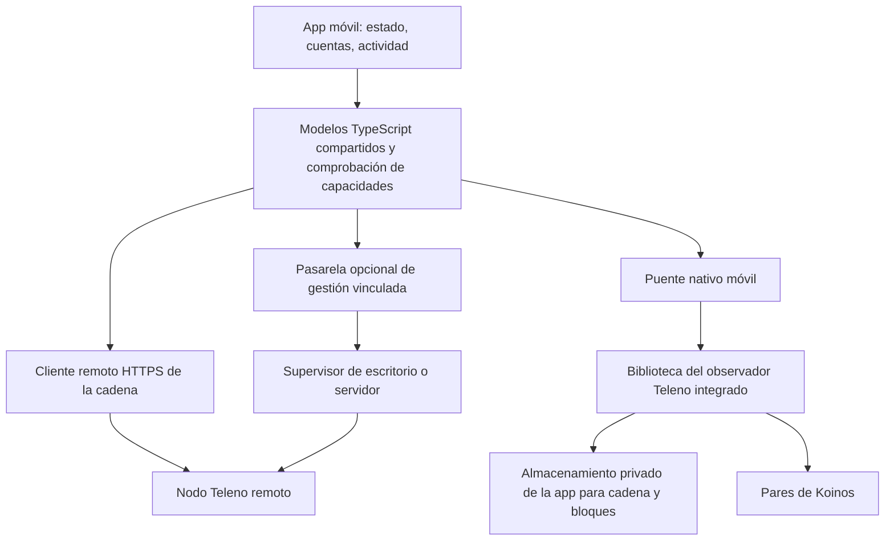

# Teleno en iOS y Android: análisis de viabilidad y plan de implementación

Fecha: 2026-09-10. Estado: **PROPUESTO — solo análisis; la adaptación móvil no está implementada.**

Traducción del [original en inglés](teleno-mobile-feasibility-and-implementation-plan.md),
revisión `1c2e85e2dc054e912ba68294d0718b3969a8181f`.

Este plan abarca la adaptación nativa de Teleno, una app móvil simplificada de
Koinos One y su publicación en la App Store de Apple y en Google Play. Las
conclusiones sobre las políticas se basan en las páginas oficiales enlazadas,
consultadas en la fecha indicada. Las estimaciones de ingeniería son criterios
de planificación, no mediciones ni compromisos de entrega.

## 1. Recomendación

Desarrollar primero una app complementaria útil para ambas plataformas y, en
paralelo a ese trabajo de producto, un prototipo que permita evaluar la
viabilidad de integrar un nodo observador. Desarrollar una sola vez el motor
nativo compartido e integrarlo primero en Android antes de comprometer una
versión pública para iOS con el nodo integrado. Las pruebas de dependencias y
políticas de iOS deben comenzar pronto para que el trabajo en Android no oculte
un impedimento en iOS.

La app complementaria debería supervisar un nodo Teleno elegido por el usuario,
mostrar KOIN/VHP/Mana y la actividad de las cuentas, y explicar con claridad el
estado de la conexión. Conviene empezar con cuentas de solo consulta. Añadir un
monedero sin custodia de terceros únicamente como una ampliación sometida a
pruebas independientes. Supervisar productores remotos resulta útil sin
introducir las claves de producción ni el bucle de producción de bloques en el
teléfono.

**Una app complementaria no es una adaptación del nodo.** La línea de trabajo
del nodo integrado descrita a continuación sí lo es: ejecuta en el dispositivo
el código de Teleno para la cadena, el almacenamiento y la red P2P. Su primer
compromiso funcional debería ser ofrecer sesiones explícitas e interrumpibles
de observación. Un productor permanentemente disponible en un teléfono no es
una base realista para este proyecto.

### Viabilidad por variante de producto

Estas valoraciones estiman la viabilidad técnica y el riesgo de revisión; no
son decisiones de las tiendas. La sección 8 detalla las políticas que las
fundamentan.

| Variante | iOS | Android | Decisión de producto |
| --- | --- | --- | --- |
| App complementaria remota con cuentas de solo consulta | Viabilidad técnica alta; vía de publicación razonable | Viabilidad técnica alta; vía de publicación razonable | Primera versión recomendada |
| Monedero sin custodia de terceros que utiliza RPC remoto | Viable; revisar custodia, entidad publicadora y alcance territorial | Viable; revisar declaraciones y alcance territorial | Ampliación independiente después del MVP de solo consulta |
| Observador integrado durante sesiones explícitas | Técnicamente plausible; pendientes políticas sobre WASM, licencias de dependencias, recursos y ciclo de vida | Técnicamente plausible; pendientes compilaciones nativas, recursos y ciclo de vida | Prototipo en ambas plataformas; estabilizar Android primero |
| Observador permanentemente disponible en segundo plano | Sin una garantía fiable de ejecución como servicio permanente de propósito general | Restringido y dependiente del dispositivo; un servicio en primer plano no garantiza disponibilidad continua | Excluir de las promesas de uso habitual en teléfonos |
| Producción de bloques en el dispositivo | Riesgo de publicación muy alto y disponibilidad poco adecuada | Riesgo de publicación en Play muy alto; los experimentos en dispositivos dedicados son otra cuestión | Excluir del alcance de las versiones para las tiendas |
| Cliente ligero que realmente verifica el protocolo | Esta revisión no ha identificado una implementación | Igual | Investigación específica del protocolo, no una opción de compilación |

Este análisis no ha producido una compilación para móviles, un perfil de
recursos medido en dispositivos ni una decisión de App Review o de Google Play.
El trabajo de viabilidad debe resolver esas incógnitas antes de prometer una
versión con el nodo integrado.

## 2. Punto de partida verificado

La revisión de Teleno inspeccionada es
`6652556bc5cf4884f7c4a20aa4ec24d409181f3d`, con `VERSION` igual a
`1.3.0-dev.0`. La modificación existente del README raíz y el plan de alto
rendimiento todavía no seguido por Git son ajenos a esta propuesta. Koinos One
se consultó en la revisión `1e844159973765615f72bd35c6c546f739322c66`, sin cambios
locales; la versión de su app es `1.2.0-dev.0`. Estas referencias identifican el
código fuente, no binarios móviles.

| Evidencia actual | Consecuencia para la adaptación |
| --- | --- |
| El [punto de entrada de CMake](../../CMakeLists.txt) utiliza C++20 y resuelve paquetes de dependencias nativas. Los [objetivos por componente](../../src/CMakeLists.txt) ya separan cadena, almacenamiento, VM, P2P, RPC y otros servicios. | Reutilizar la implementación; no es necesario reescribir el protocolo. Las bibliotecas de componentes existentes son una base útil, pero no constituyen un SDK integrable. |
| [main.cpp](../../src/main.cpp) tiene 2.241 líneas y controla la construcción de componentes, indexación, hilos, señales, claves del productor, diagnósticos y apagado. | Extraer del ejecutable el control del motor y su cancelación antes de integrarlo en el proceso de una app. |
| El [script de compilación](../../scripts/build-cpp-libp2p-koinos.sh) prepara dependencias Hunter orientadas al sistema anfitrión, bibliotecas estáticas y cpp-libp2p con parches. No se encontró ningún objetivo de compilación o CI para iOS/Android en los archivos inspeccionados. | Compilar de forma cruzada todo el árbol de dependencias. Las bibliotecas arm64 de macOS existentes no pueden enlazarse con una app iOS solo porque coincida la arquitectura de CPU. |
| El [transporte mediante puente Go](../../src/p2p/go_bridge_transport.cpp) utiliza `fork()` y `execv()`. El [transporte nativo](../../src/p2p/libp2p_transport.cpp) proporciona una implementación en C++. | Excluir de los artefactos móviles la ruta del proceso auxiliar Go y validar el transporte nativo en cada plataforma. |
| La [integración de Fizzy](../../src/koinos/vm_manager/fizzy/fizzy_vm_backend.cpp) analiza y ejecuta el WASM de los contratos, mide la ejecución y restringe las llamadas al entorno anfitrión. | Mantener su semántica. La ejecución de contratos descargados requiere un análisis específico de las políticas de las tiendas, incluso con un intérprete. |
| Los valores predeterminados de [configuración](../../src/core/config.hpp) incluyen una caché de bloques RocksDB de 256 MiB, 256 MiB para el conjunto de búferes de escritura de la base de datos, 64 MiB por búfer y un objetivo de 20 pares. La [caché de objetos de estado](../../src/koinos/state_db/backends/rocksdb/rocksdb_backend.cpp) tiene un límite contable de 64 MiB fijado en el código. | No se deben asumir los valores de escritorio como perfil móvil. Estos ajustes no representan ni el RSS medido ni un límite completo de memoria del proceso. |
| La caché de módulos de la VM admite 32 entradas, no un presupuesto de bytes. | Incluir los módulos analizados y las instancias de ejecución en la contabilidad de recursos. |
| La [documentación RPC](../rpc-endpoints.md) describe una escucha JSON-RPC amplia por defecto y una API local independiente para administrar copias de seguridad. | Las llamadas de la interfaz integrada deben permanecer dentro del proceso; la compilación móvil no debe abrir por defecto puertos de escucha RPC o de administración. |
| La [cobertura de servicios](https://github.com/koinos/koinos-one/blob/1e844159973765615f72bd35c6c546f739322c66/docs/manual/developers/deeper-references/monolith-service-coverage.md) identifica una cobertura parcial de historial y metadatos. | Una respuesta de historial vacía no debe presentarse como prueba de ausencia de actividad. |
| El [paquete de Koinos One](https://github.com/koinos/koinos-one/blob/1e844159973765615f72bd35c6c546f739322c66/package.json) utiliza Electron, React DOM, TypeScript y koilib. El [diseño del puente](https://github.com/koinos/koinos-one/blob/1e844159973765615f72bd35c6c546f739322c66/docs/manual/developers/gui/app-state-and-native-bridge.md) expone operaciones privilegiadas mediante IPC de Electron. | Reutilizar parte de la lógica de dominio y los patrones de interacción, y sustituir la capa de plataforma de escritorio. El empaquetado y la orquestación de procesos de Electron no se convierten automáticamente en funciones móviles. |
| El [servicio remoto](https://github.com/koinos/koinos-one/blob/1e844159973765615f72bd35c6c546f739322c66/electron/lib/remote-node-service.ts) invoca procesos hijos; el [servicio de monedero](https://github.com/koinos/koinos-one/blob/1e844159973765615f72bd35c6c546f739322c66/electron/lib/wallet-service.ts) depende de servicios de almacenamiento y firma de escritorio que recibe mediante inyección de dependencias. | Ninguno constituye una API de gestión móvil lista para usar ni un almacén de claves móvil revisado. |

### Las correcciones pendientes forman parte de la ruta crítica del nodo integrado

La [auditoría del software](../performance/teleno-software-audit.md) documenta
fallos reproducidos de manejo de errores de almacenamiento y atomicidad,
sesiones RPC que sobreviven a la parada, bloqueos de caché e incoherencias en
índices opcionales. El [plan de corrección](teleno-audit-remediation-plan.md)
sigue siendo una propuesta. La revisión actual conserva ese estado; este
análisis no ha vuelto a ejecutar las reproducciones.

WP1, integridad del almacenamiento; WP2, ciclo de vida; y WP3, corrección de
cachés, deben preceder a una beta con el nodo integrado. La terminación de
procesos y la presión de memoria en teléfonos amplifican precisamente estos
fallos. Un programa de pruebas puede ponerlos de manifiesto antes de corregirlos,
pero no demostrar que el producto esté listo para publicarse. Los índices
opcionales utilizados por la app también necesitan sus correcciones y pruebas
correspondientes, o deben permanecer fuera del perfil móvil. La tarea pendiente
de corrección sigue abierta; este trabajo de planificación no inicia su
implementación.

## 3. Producto móvil simplificado de Koinos One

### Primera versión: útil sin una base de datos local de la cadena

| Pantalla | Comportamiento inicial | Ampliación posterior |
| --- | --- | --- |
| Inicio | Red y nodo seleccionados, última actualización, cabecera/LIB, estado y saldos de solo consulta | Notificaciones opcionales desde un servicio de supervisión autorizado |
| Nodo | Añadir un endpoint HTTPS; inspeccionar su identidad, conectividad y capacidades; consultar los datos de estado disponibles | Vinculación con la instalación de Koinos One del usuario; sesiones explícitas de observación local |
| Cuentas | Añadir direcciones públicas, mostrar KOIN/VHP/Mana, copiar o compartir una dirección de recepción o un QR y mostrar la actividad disponible | Firma y transferencias sin custodia de terceros, sometidas a revisión |
| Actividad | Detalles de transacciones y bloques, distinción entre pendiente y confirmado/final, identificación del origen de los datos | Historial más completo cuando haya un índice compatible |
| Ajustes | Red y endpoints, privacidad, eliminación de conexiones, soporte, licencias y versión | Cuota de almacenamiento local, política de Wi-Fi y ajustes de sesión |

Conservar el lenguaje visual de Koinos One y diseñar navegación, formularios,
accesibilidad, escalado de texto y controles táctiles para teléfonos. No
trasladar sin adaptación toda la pantalla de ajustes de escritorio. El origen
seleccionado y la antigüedad de los datos deben permanecer visibles: `Nodo remoto`,
`Validación local en curso`, `Validado hasta la altura ...` e `Historial no
disponible` representan garantías distintas.

La app inicial no necesita una cuenta de la plataforma. La configuración manual
de endpoints debe funcionar antes de que exista la vinculación con el
escritorio. El RPC público de la cadena por sí solo no puede proporcionar
métricas privadas de CPU, disco o procesos; la detección de capacidades debe
ocultar o explicar los campos no disponibles. La vinculación mediante QR, las
notificaciones y un diagnóstico más completo del nodo requieren infraestructura
adicional y están planificados explícitamente más adelante.

Dejar fuera de la primera versión móvil las compilaciones nativas, la clonación
de repositorios, los comandos de terminal, la administración SFTP, la activación
de restauraciones, las consolas RPC arbitrarias, las quemas de VHP, la gestión
de claves del productor y la activación de producción. Se puede mostrar el
estado de la producción remota sin exponer esas operaciones. El descubrimiento
de pools y los flujos de asignación pueden añadirse posteriormente, una vez
especificados sus contratos de datos y transacciones.

### Elección del framework de la app

| Opción | Reutilización y ventajas | Coste y limitaciones |
| --- | --- | --- |
| React Native con TypeScript y módulos nativos | Reutiliza conocimientos de React, modelos TypeScript puros, formateadores, validación y determinadas pruebas; admite un módulo C++ compartido | Los componentes React DOM y el CSS necesitan adaptación; el ciclo de vida del sistema y la gestión de claves siguen requiriendo trabajo nativo |
| Capacitor con una interfaz web React rediseñada | Reutiliza más componentes DOM existentes; resulta práctico para un lanzamiento centrado en la app complementaria | Sigue necesitando plugins nativos para el nodo y las operaciones seguras; una WebView no mantiene activo el trabajo en segundo plano |
| SwiftUI más Kotlin/Compose | Acceso directo a la interfaz y al ciclo de vida de cada plataforma | Dos implementaciones de interfaz y menor reutilización de la app actual |

**Recomendación:** React Native si el nodo integrado forma parte estratégica del
producto. Preferir Capacitor si el equipo elige expresamente limitarse a una app
complementaria y maximizar la reutilización de la interfaz web. Ambos admiten
integración nativa; ninguno resuelve el problema del almacenamiento o la
planificación de tareas. Esta valoración se basa en la arquitectura existente y
en la documentación de [módulos C++ de React Native](https://reactnative.dev/docs/the-new-architecture/pure-cxx-modules)
y del [modelo de plugins de Capacitor](https://capacitorjs.com/docs). No prometer
un porcentaje de reutilización antes de extraer y probar los módulos reales.

## 4. Arquitectura y límites de confianza



La interfaz de datos de la cadena puede tener implementaciones remota e
integrada. Definir explícitamente capacidades, identidad de red, consultas de
solo lectura, cancelación y marcas temporales de observación. No debe sustituir
silenciosamente una validación local fallida por datos remotos y seguir
etiquetando el resultado como verificado localmente.

Una respuesta RPC remota sigue siendo una afirmación de ese servidor. Comparar
varios servidores permite detectar discrepancias, pero no crea un cliente
ligero que verifique sin confiar en ellos. Un nodo restaurado desde un punto de
control firmado confía en su publicador para el estado inicial, salvo que se
valide de forma independiente el historial correspondiente. Los hashes de
integridad y las firmas del publicador no demuestran que el estado de la cadena
sea canónico.

Un verdadero cliente ligero necesita un diseño propio para verificar consenso
y finalidad, pruebas de estado, cambios históricos de consenso, confianza en el
arranque y fuentes de datos maliciosas. Esta revisión del código no ha
establecido esa vía. Un nodo validador con poda también es un producto distinto
de un cliente ligero: sigue ejecutando y validando bloques, aunque conserva
menos datos históricos.

### Gestión remota opcional

Implementar la vinculación y la gestión como un servicio limitado y autenticado
en la app o en la capa de gestión. Teleno sigue siendo el motor del nodo. La API
actual de administración de copias de seguridad no es una API pública de
control remoto y debe seguir vinculada a la interfaz de bucle local.

Empezar con permisos de solo lectura. Utilizar TLS, un desafío de vinculación
de corta duración, identidad explícita de red y nodo, credenciales revocables
por dispositivo, límites de solicitudes y diagnósticos con datos sensibles
suprimidos. La pasarela debe exponer operaciones concretas y un estado depurado;
no debe reenviar comandos de terminal arbitrarios ni toda la API de
administración. Mantener las claves de producción en el nodo. Si posteriormente
se añaden operaciones remotas que modifican el estado, exigir revisión del
destino y de la operación, nueva autenticación, protección contra reutilización
de solicitudes, un comprobante de la operación y confirmación del estado
resultante por parte del servidor.

Para las alertas remotas, un observador o una pasarela autorizados por separado
supervisan el nodo y envían notificaciones mínimas mediante APNs/FCM. Un teléfono
suspendido no puede ser la única fuente de supervisión continua. Documentar qué
proveedor conoce los endpoints, las direcciones y las suscripciones de
notificaciones; omitir por defecto los saldos y los secretos del contenido de
las notificaciones.

## 5. Adaptación nativa del nodo

### 5.1 Extraer un motor integrable

Crear una biblioteca propuesta, `teleno_runtime`, a partir de los objetivos de
componentes existentes. Convertir `teleno_node` en un ejecutable CLI que aloje
ese mismo motor. Inyectar rutas, configuración, registro de eventos,
planificación/cancelación y señales de recursos de la plataforma. Mantener en
la capa del ejecutable el análisis de argumentos CLI, las señales del proceso,
la salida de terminal y la administración del sistema anfitrión.

Una interfaz C pequeña y versionada es adecuada para el empaquetado, con un
adaptador Objective-C++ o C++ en iOS e integración JNI/C++ en Android.
Operaciones propuestas:

```text
create(config, platform_services) -> handle
start_async(handle) -> operation_id
request_suspend(handle, reason) -> operation_id
resume_async(handle) -> operation_id
query_async(handle, typed_request) -> result
read_status(handle) -> versioned_status
subscribe(handle, bounded_event_sink) -> subscription
stop_async(handle) -> operation_id
destroy(handle) -> completion
```

Especificar las reglas de propiedad de objetos e hilos: ninguna excepción C++
cruza la ABI, las funciones de retorno no pueden sobrevivir a suscripciones o
a la destrucción del objeto, los valores del puente tienen ciclos de vida
explícitos y el hilo de interfaz nunca ejecuta reproducción de bloques,
compactación ni RPC síncrono. El trabajo nativo debe seguir funcionando
correctamente mientras el entorno JavaScript está pausado o se vuelve a crear.
Agrupar los eventos de estado y limitar los búferes en lugar de enviar a
JavaScript cada bloque o línea de registro.

Utilizar un ciclo de vida como `Stopped -> Starting -> Recovering -> Syncing -> Ready`,
con estados explícitos `Suspending`, `Suspended`, `Stopping` y de error
recuperable. La suspensión impide iniciar trabajo nuevo y guarda el progreso
en un punto de persistencia válido. Una solicitud de cancelación debe responder
con rapidez, incluso durante la indexación de arranque.

**Una recuperación correcta no puede depender de recibir un aviso de apagado.**
El sistema operativo puede terminar la app antes de que finalice la limpieza.
Las escrituras de la base de datos, los metadatos, el progreso de reproducción
y la preparación de restauraciones deben recuperarse de forma coherente tras
una terminación abrupta. Al volver a abrir, validar el último punto persistido
de forma duradera y recuperarse antes de anunciar que el nodo está listo. Una
discrepancia persistente de Merkle debe conservar la evidencia y la base de
datos existente; no desencadena su eliminación automática ni una nueva
sincronización desde cero.

### 5.2 Convertir las opciones de ejecución en límites reales de compilación

El mapa actual de funciones controla qué se inicia en ejecución; no elimina
todo el código enlazado ni la resolución de dependencias necesarias. Introducir
objetivos y opciones CMake explícitos para móviles, por ejemplo
`TELENO_BUILD_EMBEDDED` y opciones de selección de componentes. Estos nombres
son propuestas y no existen actualmente.

Para un artefacto observador destinado a las tiendas, omitir del grafo de
enlazado el bucle del productor, la creación de sus claves, el transporte
auxiliar Go, las herramientas CLI, los puertos de escucha de servidores, las
copias privadas por SFTP y la administración de servicios de escritorio.
Conservar la criptografía de firmas/VRF y el resto de la necesaria para validar
el protocolo. Eliminar la producción de bloques no demuestra que las
dependencias de verificación sean innecesarias.

Conservar la cadena y el almacenamiento de bloques necesarios. Evaluar las
dependencias de mempool/gossip antes de desactivar la admisión de transacciones.
Hacer que los índices de historial y metadatos sean realmente opcionales y
desacoplar las consultas dentro del proceso del servidor de red actual y de
sus dependencias de bibliotecas de índices. Mantener una compilación de
escritorio predeterminada con los servicios existentes para que el empaquetado
móvil no introduzca regresiones silenciosas en la operación nativa.

### 5.3 Validación de dependencias

| Componente | Trabajo necesario | Riesgo o condición de aceptación |
| --- | --- | --- |
| C++20, Boost/Asio/log, filesystem, YAML/JSON | Compilación cruzada; eliminar rutas del anfitrión y supuestos propios de un proceso independiente; proporcionar adaptadores de registro y rutas del sistema operativo | Moderado; validar herramientas de compilación y ciclo de vida |
| Koinos Proto/crypto/util y Protobuf | Separar `protoc` y los generadores del anfitrión de las bibliotecas de destino; fijar la compatibilidad entre código generado y bibliotecas de ejecución, y las revisiones exactas del código | Moderado a alto; las herramientas que se ejecutan en el anfitrión no deben ser binarios compilados para el dispositivo de destino |
| RocksDB y compresión | Compilar por plataforma; validar bloqueos, recuperación WAL, errores de volcado a disco, compactación, presión de almacenamiento y páginas de memoria de 4/16 KiB | Alto; conservar la lectura de los formatos de compresión presentes en las instantáneas admitidas |
| Fizzy y API anfitriona de Koinos | Preservar medición de ejecución, errores de ejecución de la VM (traps), límites y comportamiento histórico; ejecutar los mismos casos de prueba de bytecode en todos los destinos | La paridad es crítica; compilar de forma nativa no basta |
| cpp-libp2p con parches | Compilar la revisión parcheada del repositorio; validar Noise, RPC entre pares, gossip, descubrimiento, DNS/IPv6, reconexiones y red de cada plataforma | Alto; el soporte del proyecto original no demuestra que funcione este árbol de dependencias parcheado |
| OpenSSL, secp256k1/VRF, GMP | Validar destinos C/ensamblador, entropía, símbolos, orden de enlazado y vectores de prueba criptográficos; resolver obligaciones de redistribución | Alto; evitar cambios de protocolo para facilitar el empaquetado |
| gRPC, c-ares, re2, abseil | Eliminar del árbol móvil donde no sean necesarios; comprobar si los objetivos generados siguen incorporándolos | Moderado; `grpc: false` en ejecución no basta |
| libssh y programador/administración de copias | Excluir del móvil los servicios privados SFTP y de administración; conservar solo las primitivas seleccionadas de arranque/restauración bajo el ciclo de vida de la app | Reduce tamaño y obligaciones; sigue pendiente integrar las descargas nativas |

Fizzy se describe como un intérprete WebAssembly escrito en C++. Esto hace
innecesario un rediseño basado en JIT para la adaptación inicial, pero no
resuelve el permiso para ejecutar contratos descargados. Conservar el motor
de ejecución actual y demostrar paridad semántica.
[Proyecto Fizzy](https://github.com/wasmx/fizzy).

### 5.4 Perfil de recursos y almacenamiento

Medir toda la memoria de la app: heap nativo, cachés y memtables de RocksDB,
objetos de estado, deltas de bifurcaciones, WASM analizado, instancias de
ejecución, búferes P2P, pilas de hilos, motor JavaScript e interfaz. Las
mediciones sintéticas de caché de la auditoría previa evidencian carencias en
la contabilidad; no son una previsión de memoria móvil.

Como ajustes iniciales **experimentales** podrían utilizarse 32–64 MiB de
caché de bloques compartida, 32–64 MiB para el conjunto de memtables, 8–16 MiB
de contabilidad de caché de objetos, 1–2 hilos de trabajo de cadena, 1–2 tareas
de compactación y 2–4 pares de salida. Requieren medición y nuevas posibilidades
de configuración. No son valores predeterminados para publicar ni garantías de
un límite estricto de RSS. Corregir los fallos de caché antes de añadir su
vaciado como respuesta a avisos de memoria.

Guardar las bases de datos en almacenamiento persistente privado de la app,
separadas por identificador de cadena. Excluir los datos reconstruibles de la
cadena de las copias en la nube o del dispositivo y mantener las claves
separadas. Limitar registros, bloques en tránsito, solicitudes, historial en
caché y objetos descargados. Mostrar los requisitos de almacenamiento y la
posibilidad de cancelar antes de comenzar el arranque desde una copia.

No existe un contrato funcional de poda móvil establecido en las rutas de
almacenamiento de bloques y configuración inspeccionadas. La poda necesita una
implementación independiente: definir la altura más antigua conservada, el
horizonte de reorganizaciones, la recuperación de arranque, el servicio de datos
a otros pares, los límites de historial y la recuperación desde puntos de
control antes de eliminar datos históricos. Nunca podar estado reversible ni
material necesario para la validación del consenso.

Al planificar una restauración, reservar espacio simultáneo para la base de
datos antigua, los objetos de la instantánea descargada, los nuevos archivos
de base de datos materializados o preparados y el margen de WAL/compactación.
El tamaño comprimido de una instantánea no basta. Reutilizar y verificar el
sistema existente de firmas y manifiestos del arranque público, con un ancla
de confianza explícita y los marcadores de recuperación como observador.
Validar la apertura de instantáneas entre plataformas; no asumir que los
archivos RocksDB de escritorio sean portables entre versiones, opciones o
compilaciones de compresión arbitrarias.

No reducir límites de consenso, omitir transacciones válidas, desactivar la
verificación de bloques ni debilitar la durabilidad para ajustarse a los
recursos de un teléfono. Si un dispositivo no puede procesar una carga válida
según el protocolo, pausar, explicar la limitación y ofrecer el modo remoto.
Los perfiles de ejemplo oficiales ya eligen verificación completa; el perfil
móvil debe establecerla explícitamente en lugar de heredar un valor distinto
de la estructura de configuración.

### 5.5 El uso intermitente debe permitir ponerse al día

Sea `lambda` la tasa de llegada de bloques o trabajo, `mu` la tasa sostenible
de validación medida mientras se ejecuta el nodo y `T_off` el tiempo sin
conexión. Para una carga estable con `mu > lambda`:

```text
catch_up_time = lambda * T_off / (mu - lambda)
required_mu / lambda >= (T_on + T_off) / T_on
```

Como ejemplo, ejecutar el nodo una hora al día exige procesar durante esa hora
al menos 24 veces la tasa de llegada en vivo, sin contar el arranque inicial ni
un margen de seguridad. Es un cálculo ilustrativo de planificación, no una
medición del rendimiento de Koinos. Medir trabajo y bytes, además del número de
bloques, ya que el coste de los bloques con mucha ejecución de contratos varía
considerablemente. Una demostración breve en primer plano siguiendo la cabecera
no demuestra que el nodo siga siendo útil si la app se abre de forma intermitente.

## 6. Implementación específica por plataforma

### iOS

Compilar el núcleo C++ con el SDK de iPhoneOS y variantes independientes para
el simulador. Empaquetarlo con un puente estable en un XCFramework o un objetivo
equivalente integrado en Xcode. Utilizar un ejecutor de compilación macOS,
versiones mínimas de despliegue explícitas y paquetes de app firmados para la
tienda; no descargar binarios nativos del nodo durante la ejecución.
[Empaquetado de frameworks de Apple](https://developer.apple.com/documentation/xcode/creating-a-multi-platform-binary-framework-bundle).

Implementar primero sesiones de observación en primer plano. Utilizar las API
de transferencia en segundo plano para descargar instantáneas y tratar la
validación/importación como trabajo independiente de CPU y almacenamiento.
Evaluar `BGProcessingTask` y, en iOS 26+, `BGContinuedProcessingTask` para tareas
acotadas solicitadas por el usuario, con progreso, caducidad y cancelación.
La API de procesamiento continuado de Apple admite trabajo iniciado en primer
plano; el sistema sigue gestionando el tiempo de ejecución y el usuario puede
cancelarlo. Esto no demuestra que exista una autorización para ejecutar el
nodo como servicio permanente.
[Tareas de larga duración](https://developer.apple.com/documentation/backgroundtasks/performing-long-running-tasks-on-ios-and-ipados),
[guía de Apple sobre tareas en segundo plano](https://developer.apple.com/videos/play/wwdc2025/227/).

Gestionar la suspensión de la app, los avisos de memoria, la presión térmica,
el modo de bajo consumo, la indisponibilidad de datos protegidos mientras el
dispositivo está bloqueado y la terminación por el sistema operativo. Elegir
deliberadamente la protección de archivos; no debilitar la del monedero para
mantener activa la base de datos. Pausar los sockets y utilizar estado de
recuperación persistente. Solicitar acceso a la red local solo si lo requiere
la vinculación por LAN, admitir IPv6/NAT64 y hacer que la reconexión P2P de
salida no dependa de una dirección de entrada estable.

Como propuesta inicial, admitir iOS 18+ para la app complementaria, con
procesamiento continuado solo en los sistemas nuevos compatibles. La
validación de dispositivos y framework debe confirmar ese mínimo; elegir un
SDK de compilación no obliga a fijar la misma versión mínima del sistema
operativo. El nodo integrado puede necesitar una selección de hardware más
limitada que la app complementaria.

### Android

Utilizar el NDK de Android y sus herramientas CMake, empezando por
`arm64-v8a`. Compilar una ABI de emulador por separado cuando resulte útil.
Empaquetar las bibliotecas nativas dentro de la app/AAB y utilizar JNI o un
módulo nativo C++; un servicio Android sigue alojando código dentro del modelo
de aplicaciones y procesos de Android. Revisar que la gestión de libc++, las
opciones de excepciones/RTTI y el código independiente de posición sean
coherentes en todo el grafo de enlazado.
[Guía de CMake del NDK de Android](https://developer.android.com/ndk/guides/cmake).

Crear primero la integración con una Activity en primer plano y después evaluar
un servicio en primer plano iniciado por el usuario, con una notificación
visible de progreso y parada para una sincronización acotada. Gestionar la
muerte del proceso, Doze, los cambios de conectividad, la terminación de tareas
por el fabricante, el vencimiento del servicio, la detención forzada y el
reinicio sin prometer funcionamiento ininterrumpido.

Para apps cuyo objetivo sea Android 15+, los servicios en primer plano de tipo
`dataSync` disponen de seis horas de ejecución en segundo plano por cada
24 horas, con un comportamiento de reinicio del contador documentado cuando
el usuario vuelve al primer plano. Esta regla afecta a ese tipo de servicio,
no a todos los servicios en primer plano. Implementar la gestión de ese límite;
no asumir que otro tipo, como `specialUse`, sea una vía automáticamente aceptada
para ejecutarse de forma indefinida.
[Límites temporales de servicios en primer plano](https://developer.android.com/develop/background-work/services/fgs/timeout).

Utilizar las API de transferencias y tareas de la plataforma para descargas
reanudables cuando corresponda. El tiempo permitido para transferir datos no
autoriza la ejecución indefinida de bloques. Mantener el almacenamiento del
nodo privado de la app, excluir los datos reconstruibles de las copias del
dispositivo y evitar permisos amplios de almacenamiento externo. Android
11/API 30 como mínimo inicial de la app complementaria es una propuesta de
producto que debe validarse, distinta del requisito de SDK objetivo de Play.

Validar cada biblioteca nativa empaquetada tanto en sistemas de 4 KiB como de
16 KiB. Comprobar la alineación ELF y APK, los supuestos sobre tamaño de página
en ejecución y las bibliotecas transitivas. El requisito de tamaño de página
también se aplica si la app utiliza código nativo indirectamente a través de
su framework de interfaz. La página oficial indica actualmente el 1 de febrero
de 2027 como fecha de aplicación obligatoria para las actualizaciones; el
soporte debería incorporarse en la primera compilación, sin esperar a ese plazo.
[Soporte de 16 KiB en Android](https://developer.android.com/guide/practices/page-sizes).

## 7. Seguridad del monedero y derechos sobre las dependencias

### Ampliación con monedero

Reutilizar definiciones de red, formato de importes y modelos de transacciones
solo después de probar su comportamiento móvil. Sustituir la capa de
almacenamiento de claves y desbloqueo de escritorio. Validar derivación de
direcciones, serialización de transacciones, firmas, identificador de cadena,
nonce, pagador de recursos/Mana, texto de confirmación y finalidad frente a
casos de prueba conocidos y a la implementación de referencia.

Proteger los secretos de las cuentas con el almacenamiento de la plataforma
y acceso mediante biometría o código. Mantener el material de claves descifrado
fuera del estado persistente de JavaScript, registros, analítica, adjuntos de
informes de fallos, uso predeterminado del portapapeles y puente React siempre
que sea posible. En un firmante nativo, definir explícitamente el tiempo de
vida de la memoria y su borrado mediante sobrescritura. Si se procesan secretos
en JavaScript, no afirmar que las copias gestionadas por el recolector de
basura pueden borrarse inmediatamente de forma fiable. Probar la recuperación
independientemente del desbloqueo biométrico.

No prometer firma Koinos aislada por hardware solo porque el teléfono tenga
Secure Enclave o StrongBox. La API documentada de Apple admite NIST P-256,
distinto de secp256k1 utilizado por Koinos; Android StrongBox también documenta
compatibilidad con P-256, no una garantía universal de secp256k1. Diseñar una
clave protegida para cifrar las demás claves y un sistema de firma por software
revisado cuando sea necesario, o validar un firmante externo. Explicar esta
diferencia a los usuarios.
[Secure Enclave de Apple](https://developer.apple.com/documentation/security/protecting-keys-with-the-secure-enclave),
[Android Keystore](https://developer.android.com/privacy-and-security/keystore).

Mantener las claves operativas del productor separadas de las que controlan
los fondos y fuera del MVP móvil. La confirmación de una transacción debe
mostrar la red seleccionada, el firmante, el destino, el importe y la
operación. Un servidor remoto nunca debe poder convertir una consulta de
lectura en una solicitud de firma opaca.

### Derechos y licencias

La [licencia de Teleno](../../LICENSE) es MIT. La
[licencia actual de Koinos One](https://github.com/koinos/koinos-one/blob/1e844159973765615f72bd35c6c546f739322c66/LICENSE)
reserva los derechos de copia, modificación y distribución salvo que exista
permiso o una licencia independiente. Confirmar los derechos de la entidad
publicadora móvil antes de extraer código o recursos de la app. Compartir una
marca de proyecto no demuestra que todo el código tenga la misma licencia.

El script nativo compila GMP estáticamente y el grafo CMake lo enlaza
explícitamente para dependencias relacionadas con VRF. GMP 6.3.0 ofrece
licencias LGPLv3 o GPLv2; libssh también tiene obligaciones LGPL. Una licencia
permisiva del nodo no sustituye las obligaciones de sus dependencias. Revisar
las versiones exactas distribuidas, avisos, obligaciones sobre código fuente
y reenlazado, condiciones de firma y distribución, y posibles excepciones con
asesoramiento especializado en licencias antes de comprometer un binario móvil
público. Es una condición para publicar, no la conclusión de que cualquier
dependencia LGPL esté automáticamente prohibida en ambas tiendas.
[Condiciones de copia de GMP](https://gmplib.org/manual/Copying),
[licencias de libssh](https://www.libssh.org/development/).

Eliminar SFTP del móvil evita distribuir libssh para esa función. Eliminar GMP
puede exigir una implementación criptográfica compatible y una revisión
exhaustiva de paridad; desactivar únicamente el productor no demuestra que
pueda eliminarse. Registrar un inventario de componentes de software (SBOM)
y la resolución de las obligaciones de licencia de ambos artefactos móviles
y de sus árboles de dependencias nativas y de interfaz.

## 8. Viabilidad en App Store y Google Play

### Apple: reglas publicadas y su aplicación

Las restricciones publicadas por Apple que resultan relevantes son breves,
pero significativas:

- La sección 3.1.5(ii) limita la minería de criptomonedas al procesamiento fuera
  del dispositivo.
- La sección 3.1.5(i) permite apps de monedero para almacenar criptomonedas,
  publicadas por desarrolladores inscritos como organización.
- La sección 2.5.2 restringe el código descargado que cambia la funcionalidad
  de la app; un intérprete no constituye una excepción general explícita para
  los contratos de blockchain.
- Las secciones 2.4.2 y 2.5.4 tratan el uso de recursos y el trabajo adecuado
  en segundo plano.
- Las secciones 2.1, 2.3.1 y 4.2 exigen funcionalidad útil, revisable y descrita
  con precisión. La sección 3.1 regula las funciones digitales de pago.

**Valoración:** una app complementaria remota útil tiene una vía de publicación
razonable. La producción PoB en el dispositivo presenta un riesgo de rechazo
muy alto; las reglas no eximen expresamente a PoB. Un observador no produce
recompensas, pero la ejecución de contratos descargados sigue siendo una
cuestión de revisión sin resolver. Explicar a App Review la validación WASM y
su API anfitriona restringida mediante una compilación concreta. Considerar
sus comentarios como orientación, no como garantía de aprobación. No ocultar
la ejecución bajo la etiqueta «datos de blockchain».
[Directrices de revisión de apps](https://developer.apple.com/app-store/review/guidelines/).

Demostrar que la ejecución de contratos no puede cargar bibliotecas nativas
ni acceder a servicios de la plataforma o de la interfaz. Ese límite técnico
respalda la explicación para la revisión; no establece una excepción.

### Google Play: reglas publicadas y su aplicación

Google prohíbe la minería de criptomonedas en el dispositivo y permite su
gestión remota. Su política de blockchain también exige las declaraciones
pertinentes sobre activos tokenizados y restringe la promoción de posibles
ganancias mediante juegos o negociación. **Valoración:** la supervisión de
nodos y productores remotos tiene una vía de publicación razonable; la
producción PoB en el dispositivo es una función de publicación de muy alto
riesgo porque no se establece una excepción explícita para PoB. Un consumo
bajo de CPU no establece una excepción.
[Contenido basado en blockchain](https://support.google.com/googleplay/android-developer/answer/13607354?hl=en).

La guía de Google sobre exchanges y monederos por país excluye explícitamente
los monederos sin custodia de terceros del alcance de esa política concreta.
Esto no elimina otros requisitos de Play ni la legislación aplicable. Los
servicios de custodia, intercambio, dinero fiduciario o productos gestionados
de obtención de rendimientos necesitan una evaluación específica de sus
funciones y territorios de lanzamiento. En particular, no afirmar que un
monedero exclusivamente sin custodia de terceros necesita automáticamente los
mismos registros nacionales que un exchange.
[Guía sobre la política de exchanges y monederos](https://support.google.com/googleplay/android-developer/answer/16329703?hl=en).

Play restringe las actualizaciones por cuenta propia y la descarga de
ejecutables nativos, e incluye una excepción para intérpretes o máquinas
virtuales sujeta al resto de sus políticas. El comportamiento WASM exacto de
Teleno necesita documentación y revisión conforme a esa regla. Los servicios
en primer plano deben tener tipos justificados, una finalidad y controles
visibles para el usuario, y ejecutarse solo durante el tiempo necesario; la
documentación de la declaración puede incluir un vídeo de demostración.
**Valoración:** empaquetar el código nativo a través de Play y evaluar sesiones
acotadas de observación. Revisar el comportamiento de retransmisión P2P según
las restricciones sobre servicios proxy de esa misma política; desactivar el
servicio opcional de retransmisión general en el perfil del teléfono. Un
servicio en primer plano no establece disponibilidad continua.
[Política sobre dispositivos, red y servicios en primer plano](https://support.google.com/googleplay/android-developer/answer/16559646?hl=en).

### Requisitos de publicación que deben planificarse

| Requisito | Acción de implementación o publicación |
| --- | --- |
| Identidad de la entidad publicadora | Utilizar la organización autorizada para el producto de monedero. Google también orienta a los proveedores de servicios financieros hacia cuentas de organización y exige D-U-N-S para verificarlas. [Tipos de cuenta de Google](https://support.google.com/googleplay/android-developer/answer/13634885?hl=en). |
| Herramientas actuales para subir apps iOS | Según lo comprobado, las subidas requieren Xcode 26+ con el SDK iOS 26+, desde el 28 de abril de 2026. Volver a comprobarlo al enviar la app; es distinto del sistema operativo mínimo admitido en dispositivos. [Requisitos de Apple](https://developer.apple.com/news/upcoming-requirements/). |
| SDK objetivo actual de Android | Según lo comprobado, las apps nuevas y sus actualizaciones deben tener Android 16/API 36+ como objetivo desde el 31 de agosto de 2026. No planificar una nueva publicación suponiendo que se concederá una prórroga. [Política de API objetivo de Play](https://support.google.com/googleplay/android-developer/answer/11926878?hl=en). |
| Declaraciones de privacidad | Publicar el flujo real de datos de consultas RPC, direcciones, vinculación de nodos, diagnósticos y proveedores de notificaciones. Completar tanto los [detalles de privacidad de Apple](https://developer.apple.com/app-store/app-privacy-details/) como la sección [Seguridad de los datos de Play](https://support.google.com/googleplay/android-developer/answer/10787469?hl=en). Consultar datos públicos de la cadena puede revelar intereses y tenencias del usuario. |
| Privacidad de dependencias nativas en Apple | Auditar las API de archivos, disco y demás API cubiertas, incluidas las bibliotecas de terceros, y aportar motivos y manifiestos válidos cuando se exijan. [API que requieren justificación](https://developer.apple.com/documentation/bundleresources/describing-use-of-required-reason-api), [manifiestos de privacidad](https://developer.apple.com/documentation/bundleresources/adding-a-privacy-manifest-to-your-app-or-third-party-sdk). |
| Cifrado | Completar la clasificación de exportación de la implementación real de TLS, P2P, almacenamiento y firma; no asumir que una exención aplicable solo a HTTPS cubre todo Teleno. [Cumplimiento de exportación de Apple](https://developer.apple.com/help/app-store-connect/manage-app-information/overview-of-export-compliance/). |
| Declaraciones financieras | Completar la declaración de funciones financieras aunque se declare que la app no ofrece ninguna; seleccionar con precisión monedero u otras funciones aplicables. También afecta a los canales de pruebas de Play indicados. [Guía de declaración financiera](https://support.google.com/googleplay/android-developer/answer/13849271?hl=en). |
| Eliminación de cuentas | Si se introduce una cuenta de servicio, implementar la eliminación de cuenta y datos y explicar la retención. Eliminar una cuenta de servicio no borra el historial de la cadena. Las direcciones de solo consulta no exigen por sí mismas crear un sistema de cuentas en el servidor. [Requisitos de eliminación de Play](https://support.google.com/googleplay/android-developer/answer/13327111?hl=en). |
| Acceso para pruebas | Planificar TestFlight y las pruebas de Play con un acceso revisable que no exponga secretos. Si se utiliza una cuenta personal nueva de Play, el requisito indicado es una prueba cerrada con 12 participantes inscritos durante 14 días continuos antes de solicitar acceso a producción; no es un requisito universal para cuentas de organización. [Reglas de pruebas de Play](https://support.google.com/googleplay/android-developer/answer/14151465?hl=en). |

### Estrategia para las tiendas

Presentar la app complementaria como un producto completo y útil. Mantener el
observador nativo como una ampliación sometida a revisión independiente hasta
superar las comprobaciones del motor, derechos y recursos. Preparar un
expediente de revisión con los modos de la app, un diagrama del flujo de datos,
los límites de ejecución de contratos, los permisos reales, el consumo de
recursos medido, los derechos de publicación y unos pasos que los revisores
puedan completar sin descargar durante mucho tiempo la cadena ni acceder a un
productor privado.

Si se rechaza el observador integrado, mantener la versión complementaria
mientras se resuelve la objeción concreta o se apela con pruebas. Una
compilación en simulador o la aceptación en TestFlight no demuestra que la app
sea admisible en la tienda pública. Puede considerarse distribuir fuera de
Play un nodo experimental Android, pero eso constituye un proyecto distinto
de distribución, seguridad y actualizaciones y no elimina los límites del
sistema operativo. La distribución alternativa de iOS también necesita su
propio análisis de elegibilidad.

La primera versión debería prescindir de servicios de intercambio, custodia,
minería de pago y productos de rendimiento. Esto acota el alcance de ingeniería
y producto. Cualquier función de pago, servicio alojado o transacción con
tokens que se añada después necesita una evaluación actualizada de las
políticas de pagos y de la tienda en cada mercado; utilizar criptomonedas no
es un sustituto general de la facturación de la plataforma. Los territorios
de lanzamiento deben ajustarse al modelo real de servicio, con revisión legal
cuando se introduzcan servicios regulados.

## 9. Paquetes de trabajo de implementación

Todas las rutas de los paquetes que figuran a continuación son propuestas.
Las estimaciones se expresan en **semanas de trabajo de una persona de
ingeniería**, incluidas pruebas de componentes e integración. Solo pueden
solaparse si hay personal suficiente. Excluyen los tiempos impredecibles de
revisión externa. El trabajo comenzará tras una solicitud independiente de
implementación; este documento no ejecuta ninguna fase.

| Paquete | Alcance, repositorio responsable y entregable | Dependencia o criterio para completar | Esfuerzo |
| --- | --- | --- | --- |
| M0 — evidencia de viabilidad | Teleno: manifiesto exacto de dependencias y licencias; programas nativos mínimos de prueba en Android e iOS para almacenamiento, VM, criptografía y transporte. Responsable de la app: derechos de publicación y reutilización, usuarios y dispositivos objetivo, explicación para la revisión de las tiendas. | Registrar fallos reales de compilación/enlazado y resultados en dispositivos; decidir qué impedimentos del nodo integrado pueden resolverse. Solicitar aclaraciones de políticas cuando sea posible sin suponer una aprobación anticipada. | 4–6 |
| M1 — app complementaria | App móvil de Koinos One: interfaces de dominio y transporte, interfaz para teléfonos, endpoints HTTPS, cuentas de solo consulta, actividad y estado adaptados a las capacidades disponibles, accesibilidad, preferencias locales y automatización de publicación. | Decisiones de producto y derechos de M0; funcionamiento útil en ambos sistemas, incluidos endpoints desactualizados o incorrectos. No depende de un núcleo integrado. | 8–12 |
| M2 — base nativa compartida | Teleno: trabajo previo de WP1–WP3, extracción del motor, cancelación, separación de componentes en compilación, compilación de dependencias para anfitrión y destino, ABI y cobertura de regresiones en escritorio. | Viabilidad nativa de M0; sin impedimentos de publicación en persistencia, ciclo de vida o cachés; comportamiento de escritorio preservado. | 10–16 |
| M3 — observador Android | Teleno: artefacto NDK. App móvil: adaptador nativo, servicio de sesiones, interfaz de almacenamiento y arranque desde copia, reconexiones, gestión de interrupciones e instrumentación de recursos. | M2; superar pruebas de paridad en hardware Android, terminación/reapertura, recursos y 16 KiB. | 6–10 |
| M4 — observador iOS | Teleno: artefacto iOS. App móvil: adaptador nativo, ciclo de vida de la app, protección de datos, integración de trabajo acotado y descargas, validación de recursos en dispositivos. | M2 y evidencia temprana sobre políticas y licencias en iOS; observador revisable con un comportamiento aceptable al ponerse al día. Puede solaparse con M3 si hay otra persona de ingeniería. | 8–12 |
| M5 — validación de la versión con nodo integrado | Ambos repositorios: validación histórica representativa, casos adversos, pruebas prolongadas de interrupciones y temperatura, verificación de paquetes y licencias, correcciones de beta y expediente para las tiendas. | M3/M4 por plataforma; superar todos los criterios de publicación descritos más adelante. | 6–10 |
| O1 — monedero móvil | App: gestión nativa/de plataforma de secretos, recuperación, firma, confirmaciones, revisión independiente de seguridad y alcance territorial. | M1 más decisiones de derechos y entidad publicadora; superar validación en testnet y recuperación antes de publicar el monedero para producción. | 6–10 adicionales, más revisión externa |
| O2 — vinculación y alertas remotas | App/capa de gestión: vinculación con escritorio, pasarela autenticada de solo lectura, revocación, estado del nodo depurado y retransmisión opcional APNs/FCM. | M1; responsabilidades explícitas sobre operación y datos, y aislamiento de endpoints. | 4–8 adicionales, más operación continua del servicio |
| O3 — retención o verificación de cliente ligero | Teleno/protocolo: especificar los contratos pendientes de retención y pruebas, e implementarlos y validarlos como capacidades independientes. | Solo si las mediciones de M0/M3 muestran que el diseño sin poda no cumple el presupuesto de recursos del producto. | Volver a estimar después del diseño; no incluido en lo anterior |

El programa base completo M0–M5 supone aproximadamente **42–66 semanas de
ingeniería**. Un equipo con una persona de C++/almacenamiento, otra de desarrollo
móvil y apoyo parcial de pruebas y diseño puede planificar aproximadamente
**6–9 meses** para ambas variantes integradas, si se superan las condiciones
de aceptación. Un rechazo por políticas, la sustitución de dependencias
criptográficas o la necesidad de poda podrían ampliar considerablemente ese
plazo. La app complementaria puede aspirar a una línea de publicación de
**10–16 semanas** con ese equipo y el trabajo de viabilidad solapado. Una
implementación individual debe planificarse con bastante más tiempo:
aproximadamente **10–16 meses** para el alcance base con nodo integrado, antes
de capacidades opcionales o impedimentos importantes.

Estas estimaciones presuponen experiencia previa con el protocolo Koinos,
acceso a dispositivos de prueba adecuados y a un conjunto representativo de
datos de la cadena, sin reescritura del consenso ni servicio de custodia.
Volver a estimar después de M0 a partir de los fallos medidos durante la
adaptación. Para elaborar un presupuesto económico, multiplicar los paquetes
seleccionados por los costes reales completos del equipo y añadir dispositivos,
CI, entidad publicadora, revisión legal y de seguridad, y servicios opcionales
de retransmisión; aquí no se asume ninguna tarifa ni presupuesto de gasto.

### Secuencia inicial de implementación

1. Acordar el alcance inicial de la app complementaria y el observador, y los
   derechos de publicación; seleccionar el iPhone más antiguo que se admitirá
   y al menos un Android de gama media para pruebas.
2. Fijar revisiones de código y dependencias, y compilar un programa nativo
   mínimo de pruebas para cada destino; ejecutar una invocación real de la VM,
   escritura y reapertura de RocksDB, vectores criptográficos y una conexión
   nativa a un par, sin limitarse a una demostración de enlazado.
3. Registrar memoria, disco, temperatura y capacidad de ponerse al día en los
   dispositivos; plantear preguntas concretas sobre las políticas de WASM en
   un observador y mantener el código productor fuera del artefacto previsto
   para las tiendas.
4. Empezar el trabajo de dominio e interfaz de la app complementaria mientras
   se implementan los requisitos nativos aprobados. Conservar una app
   complementaria publicable si se detiene la línea del nodo integrado.
5. Estabilizar las sesiones de observación Android y después validar iOS y
   ambas compilaciones para las tiendas frente al mismo conjunto de datos de
   cadena y los mismos criterios de publicación.

## 10. Verificación y condiciones de publicación

| Control | Evidencia requerida | Actuación si falla |
| --- | --- | --- |
| G0 — compilación y derechos | Compilaciones cruzadas limpias y reproducibles; revisiones exactas de dependencias y SBOM; reutilización autorizada de la app y grafo de enlazado nativo redistribuible | Resolver problemas de dependencias y derechos o conservar solo los artefactos de la app complementaria |
| G1 — paridad del protocolo | Mismos identificadores de bloques, recibos, medición de ejecución, raíces de estado y resultados de LIB/bifurcación que la referencia sobre un conjunto fijo de datos; casos de excepción histórica y entradas inválidas | Detener la publicación del nodo integrado; no relajar la validación |
| G2 — integridad ante interrupciones | Terminaciones repetidas del proceso durante escrituras de bloques, indexación, WAL/volcado, compactación y activación del arranque desde copia; coherencia tras reintentos y reaperturas, con marcadores de recuperación preservados | Corregir durabilidad y ciclo de vida o mantenerlo únicamente como prototipo |
| G3 — viabilidad de recursos | Memoria de toda la app, bytes escritos al día, pico de disco durante el arranque desde copia, sincronización estable, comportamiento térmico y puesta al día en el dispositivo mínimo | Limitar los dispositivos admitidos o implementar optimizaciones y retención basadas en mediciones |
| G4 — resistencia de la red | Cambios entre Wi-Fi y datos móviles, política de conexiones medidas/sin conexión, IPv6/NAT64, pares de otra cadena, tormentas de reconexión, respuestas parciales, pares maliciosos y cambios de reloj | Corregir transporte e identificación del origen de datos antes de la beta |
| G5 — confianza del usuario y claves | Estado local/remoto explícito, gestión del historial incompleto, credenciales aisladas, recuperación y firmas verificadas si se habilita el monedero, ausencia de ruta de productor en el paquete observador | Retirar la función incompleta o corregirla |
| G6 — artefacto para la tienda | Pruebas de versiones de publicación instaladas; permisos, manifiestos, firmas, archivos de símbolos, comprobaciones de SDK y tamaño de página; acceso de los revisores y descripción precisa de funciones | Retrasar ese artefacto y conservar una versión complementaria válida de forma independiente |

**Objetivos iniciales de aceptación** propuestos, que deben confirmarse en M0
y no presentarse como rendimiento ya alcanzado:

- Al menos un iPhone antiguo dentro de los admitidos, un iPhone actual, un
  Android de gama media y un entorno Android de 16 KiB; los simuladores
  complementan los dispositivos reales.
- Un presupuesto provisional del nodo integrado inferior a 500 MiB de memoria
  estable de toda la app y a 800 MiB durante la reproducción, en los dispositivos
  mínimos acordados, revisado según la presión del sistema observada. No se
  presupone un umbral universal de terminación por memoria en iOS.
- Una prueba de 24 horas en primer plano o en sesiones permitidas sin crecimiento
  ilimitado, más una prueba de uso intermitente de varios días que demuestre el
  plazo de puesta al día prometido.
- Al menos 100 ciclos aleatorios de terminación y reapertura por plataforma,
  que abarquen estados de persistencia y ciclo de vida, más fallos deterministas
  inyectados en puntos conocidos.
- Acuse de recibo rápido de la cancelación, con un objetivo inferior a un
  segundo, y una recuperación probada cuando el apagado seguro no pueda acabar
  dentro del tiempo concedido por el sistema operativo.
- Ausencia de estado térmico crítico con la carga admitida; pausar o reducir
  trabajo opcional ante avisos térmicos. Registrar consumo de batería y
  escrituras antes de anunciar cifras de autonomía.

Los objetivos de memoria son hipótesis de aceptación del producto, no motivos
para rechazar bloques válidos según el protocolo. Si las cargas válidas más
exigentes los superan, deben cambiar las condiciones de soporte o el modo del
producto. Los resultados CTest existentes de la auditoría no sustituyen estos
controles. Durante la implementación nativa, ejecutar pruebas específicas,
CTest más amplio para cambios compartidos, reproducción frente a la referencia
y comprobaciones básicas de identidad binaria y CLI; las pruebas móviles deben
ejercitar el código de publicación instalado.

## 11. Responsabilidades de repositorios y versiones

Teleno es responsable del motor reutilizable, la interfaz C/C++, la compilación
de dependencias nativas, las pruebas de protocolo y almacenamiento, los
artefactos nativos móviles, el versionado nativo y la documentación CLI. Entre
las incorporaciones propuestas están `src/runtime/`, `include/teleno/`,
`cmake/mobile/`, scripts de compilación por plataforma y programas de pruebas
móviles.

Koinos One es responsable de la app y la capa de gestión. Un espacio de trabajo
propuesto `mobile/` y un paquete de dominio TypeScript extraído de forma acotada
pueden residir allí una vez decididos los derechos y la estructura del
repositorio. También es posible un repositorio móvil independiente, pero no
debe duplicar código de consenso. Este documento no modifica la aplicación de
escritorio ni la revisión fijada de su submódulo.

Publicar artefactos nativos versionados con el commit exacto de Teleno, opciones
de compilación, versiones fijadas de dependencias, versión de ABI, archivos de
símbolos y avisos de licencia. El consumidor móvil fija deliberadamente esos
artefactos; los productos de escritorio y móvil mantienen versiones
independientes. Volver a comprobar políticas de las tiendas y requisitos de
herramientas en cada envío. Conservar los controles existentes de publicación
nativa y de escritorio, y actualizar los manuales afectados cuando cambie
realmente el comportamiento.

## 12. Decisiones posteriores al prototipo de viabilidad

Las opciones recomendadas son una app complementaria de solo consulta, React
Native para la estrategia de nodo integrado a largo plazo, sesiones explícitas
de observación y producción fuera del dispositivo. El prototipo debe
determinar si el presupuesto nativo de memoria y almacenamiento y la puesta al
día con uso intermitente son realistas, si la ejecución de contratos en iOS
puede superar la revisión y si las licencias de las dependencias permiten la
compilación prevista.

Si se superan esos controles, proceder con la adaptación nativa por etapas.
Si fallan, la app complementaria sigue siendo un producto útil y puede evaluarse
un proyecto específico de cliente ligero o retención a partir de mediciones.
Ninguno de los dos resultados debe describirse como una adaptación móvil
completada del nodo completo antes de superar los controles nativos.
