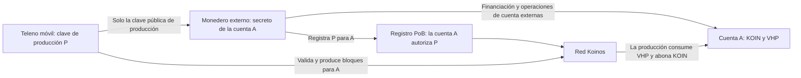
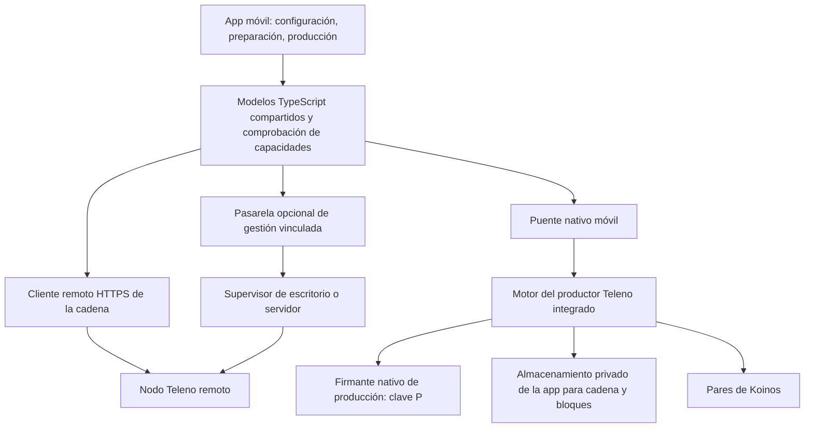

# Teleno en iOS y Android: viabilidad e implementación de un productor móvil

Fecha: 2026-09-10. Estado: **PROPUESTO — solo análisis; sin implementación móvil ni aprobación de las tiendas.**

Traducción del [documento en inglés](teleno-mobile-feasibility-and-implementation-plan.md).

Este plan abarca un productor Teleno integrado, una app móvil mínima con
custodia externa de los fondos y la publicación en App Store y Google Play
con un editor individual cuando sea admisible. Reúne decisiones de producto,
implementación técnica y condiciones de distribución en un solo documento.
Las fuentes de políticas y cuotas se comprobaron en la fecha indicada; las
estimaciones y objetivos de aceptación son criterios de planificación, no
resultados medidos ni compromisos de entrega.

## 1. Objetivo del producto y viabilidad

Desarrollar una app mínima que ejecute Teleno y produzca bloques de **Proof of
Burn (PoB) de Koinos** en el teléfono, mientras el usuario controla KOIN/VHP
desde un monedero externo. La app solo conserva una clave de producción
independiente. Un prototipo útil debe producir un bloque aceptado por un nodo
de referencia independiente; mostrar estado remoto o sincronizar como
observador no basta.

PoB es la hipótesis de consenso porque el modelo de financiación solicitado
utiliza VHP. Teleno selecciona `pob` o `federated` y no implementa Proof of Work.
Un requisito literal de PoW exigiría un proyecto distinto de consenso y red;
no puede introducirse como una opción de empaquetado móvil.

| Área | Evaluación | Evidencia o decisión necesaria |
| --- | --- | --- |
| Producción con custodia externa de fondos | La separación existente de dirección productora y clave de firma lo permite | Firmante móvil seguro, registro autorizado externamente, VHP efectivo y producción PoB real |
| Productor integrado en iOS/Android | Prototipo de ingeniería plausible; no se ha demostrado compilación móvil ni producción en dispositivos | Compilaciones cruzadas, paridad con la referencia, recuperación ante interrupciones, tiempo apto para producir y mediciones de almacenamiento y temperatura |
| Ambas tiendas públicas con editor individual | No existe una vía de lanzamiento acreditada para este productor local | Tipo de cuenta correcto y revisión de todas las funciones declaradas; ninguna regla de minería exime expresamente a PoB |
| Producción continua en el teléfono | No es una promesa predeterminada de disponibilidad creíble | Un modo de operación admitido debe demostrar producción útil pese a la suspensión y la recuperación del retraso |
| App que gestiona un productor externo | Vía más plausible de distribución y disponibilidad | Decisión de producto independiente y gestión autenticada; no equivale a completar la producción local |

Priorizar la viabilidad del productor nativo y su clasificación en las tiendas
antes de desarrollar una app amplia. Integrar primero Android tras completar
la base compartida y realizar pronto las pruebas de dependencias, ciclo de
vida y políticas de iOS. Iniciar y recuperar siempre como observador; habilitar
la producción solo tras una acción explícita del usuario y las comprobaciones
de preparación. El modo observador es un estado de seguridad de este producto
para productores.

Excluir de la app un monedero de fondos, intercambio, quemas, cartera general
y firma arbitraria de transacciones. Eliminar esas funciones reduce el alcance,
pero no resuelve las restricciones de minería local ni el coste de adaptar
todo el motor validador. La sección 8 separa inscripción y admisión; la sección
12 recoge las alternativas de despliegue.

## 2. Punto de partida verificado

La revisión de Teleno examinada es `299a0bfc151bca7c8727cfadabfdc21ebc19046d`,
con `VERSION` igual a `1.3.0-dev.0`. El código nativo no ha cambiado respecto
a `6652556bc5cf4884f7c4a20aa4ec24d409181f3d`. Koinos One se consultó en
`1e844159973765615f72bd35c6c546f739322c66`, con versión de app `1.2.0-dev.0`.
Estas referencias identifican código fuente, no binarios móviles.

| Evidencia actual | Consecuencia para la adaptación |
| --- | --- |
| El [punto de entrada de CMake](../../CMakeLists.txt) utiliza C++20 y resuelve paquetes de dependencias nativas. Los [objetivos por componente](../../src/CMakeLists.txt) ya separan cadena, almacenamiento, VM, P2P, RPC y otros servicios. | Reutilizar la implementación; no es necesario reescribir el protocolo. Las bibliotecas de componentes existentes son una base útil, pero no constituyen un SDK integrable. |
| [main.cpp](../../src/main.cpp) tiene 2.241 líneas y controla la construcción de componentes, indexación, hilos, señales, claves del productor, diagnósticos y apagado. | Extraer del ejecutable el control del motor y su cancelación antes de integrarlo en el proceso de una app. |
| El [script de compilación](../../scripts/build-cpp-libp2p-koinos.sh) prepara dependencias Hunter orientadas al sistema anfitrión, bibliotecas estáticas y cpp-libp2p con parches. No se encontró ningún objetivo de compilación o CI para iOS/Android en los archivos inspeccionados. | Compilar de forma cruzada todo el árbol de dependencias. Las bibliotecas arm64 de macOS existentes no pueden enlazarse con una app iOS solo porque coincida la arquitectura de CPU. |
| El [transporte mediante puente Go](../../src/p2p/go_bridge_transport.cpp) utiliza `fork()` y `execv()`. El [transporte nativo](../../src/p2p/libp2p_transport.cpp) proporciona una implementación en C++. | Excluir de los artefactos móviles la ruta del proceso auxiliar Go y validar el transporte nativo en cada plataforma. |
| La [integración de Fizzy](../../src/koinos/vm_manager/fizzy/fizzy_vm_backend.cpp) analiza y ejecuta el WASM de los contratos, mide la ejecución y restringe las llamadas al entorno anfitrión. | Mantener su semántica. La ejecución de contratos descargados requiere un análisis específico de las políticas de las tiendas, incluso con un intérprete. |
| Los valores predeterminados de [configuración](../../src/core/config.hpp) incluyen una caché de bloques RocksDB de 256 MiB, 256 MiB para el conjunto de búferes de escritura de la base de datos, 64 MiB por búfer y un objetivo de 20 pares. La [caché de objetos de estado](../../src/koinos/state_db/backends/rocksdb/rocksdb_backend.cpp) tiene un límite contable de 64 MiB fijado en el código. | No se deben asumir los valores de escritorio como perfil móvil. Estos ajustes no representan ni el RSS medido ni un límite completo de memoria del proceso. |
| La caché de módulos de la VM admite 32 entradas, no un presupuesto de bytes. | Incluir los módulos analizados y las instancias de ejecución en la contabilidad de recursos. |
| La [documentación RPC](../rpc-endpoints.md) describe una escucha JSON-RPC amplia por defecto y una API local independiente para administrar copias de seguridad. | Las llamadas de la interfaz integrada deben permanecer dentro del proceso; la compilación móvil no debe abrir por defecto puertos de escucha RPC o de administración. |
| La [cobertura de servicios](https://github.com/koinos/koinos-one/blob/1e844159973765615f72bd35c6c546f739322c66/docs/manual/developers/deeper-references/monolith-service-coverage.md) identifica una cobertura parcial de historial y metadatos. | Una respuesta de historial vacía no debe presentarse como prueba de ausencia de actividad. |
| El [paquete de Koinos One](https://github.com/koinos/koinos-one/blob/1e844159973765615f72bd35c6c546f739322c66/package.json) utiliza Electron, React DOM, TypeScript y koilib. El [diseño del puente](https://github.com/koinos/koinos-one/blob/1e844159973765615f72bd35c6c546f739322c66/docs/manual/developers/gui/app-state-and-native-bridge.md) expone operaciones privilegiadas mediante IPC de Electron. | Reutilizar parte de la lógica de dominio y los patrones de interacción, y sustituir la capa de plataforma de escritorio. El empaquetado y la orquestación de procesos de Electron no se convierten automáticamente en funciones móviles. |
| El [servicio remoto](https://github.com/koinos/koinos-one/blob/1e844159973765615f72bd35c6c546f739322c66/electron/lib/remote-node-service.ts) invoca procesos hijos; el [servicio de monedero](https://github.com/koinos/koinos-one/blob/1e844159973765615f72bd35c6c546f739322c66/electron/lib/wallet-service.ts) depende de servicios de almacenamiento y firma de escritorio que recibe mediante inyección de dependencias. | Ninguno constituye una API de gestión móvil lista para usar ni un almacén de claves móvil revisado. |

### Las correcciones pendientes forman parte de la ruta crítica del nodo integrado

La [auditoría del software](../performance/teleno-software-audit.md) documenta
fallos reproducidos de manejo de errores de almacenamiento y atomicidad,
sesiones RPC que sobreviven a la parada, bloqueos de caché e incoherencias en
índices opcionales. El [plan de corrección](teleno-audit-remediation-plan.md)
sigue siendo una propuesta. La revisión actual conserva ese estado; este
análisis no ha vuelto a ejecutar las reproducciones.

WP1, integridad del almacenamiento; WP2, ciclo de vida; y WP3, corrección de
cachés, deben preceder a una beta con el nodo integrado. La terminación de
procesos y la presión de memoria en teléfonos amplifican precisamente estos
fallos. Un programa de pruebas puede ponerlos de manifiesto antes de corregirlos,
pero no demostrar que el producto esté listo para publicarse. Los índices
opcionales utilizados por la app también necesitan sus correcciones y pruebas
correspondientes, o deben permanecer fuera del perfil móvil. La tarea pendiente
de corrección sigue abierta; este trabajo de planificación no inicia su
implementación.

### Evidencia del productor y los contratos

La [configuración del productor](../../src/block_production/block_producer.hpp)
de Teleno separa `producer_address` de la clave de firma. La
[implementación](../../src/block_production/block_producer.cpp) carga o crea
una clave WIF, implementa VRF y firma de bloques PoB y muestra una dirección
derivada de la clave distinta de la cuenta de fondos y recompensas configurada.

El [contrato PoB](https://github.com/koinos/koinos-one/blob/1e844159973765615f72bd35c6c546f739322c66/vendor/koinos/koinos-contracts-as/contracts/pob/assembly/Pob.ts)
examinado exige que la cuenta productora autorice el registro de la clave,
utiliza esa clave para las pruebas y aplica a esa cuenta el consumo de VHP y
las recompensas KOIN. El [contrato VHP](https://github.com/koinos/koinos-one/blob/1e844159973765615f72bd35c6c546f739322c66/vendor/koinos/koinos-contracts-as/contracts/vhp/assembly/Vhp.ts)
admite transferencias autorizadas y retrasa los aumentos de saldo efectivo.
La separación propuesta no necesita un contrato de custodia nuevo ni cambios
de consenso.

Estos hallazgos describen código examinado, no una auditoría nueva que lo
compare con el WASM desplegado. Verificar identidad de contratos, parámetros,
registro y saldos efectivos de la red seleccionada antes de activar. Seguir
la [guía de activación del productor](../running-producer-node.md).

## 3. App mínima y custodia externa de fondos

Utilizar dos identidades distintas:

| Identidad | Qué controla | Dónde se conserva su secreto |
| --- | --- | --- |
| Cuenta A: dirección de fondos y recompensas | Transferencias de KOIN/VHP, quemas externas y registro o sustitución de la clave de producción | En el monedero externo del usuario; nunca se importa a la app productora |
| Clave P: clave de producción | Pruebas VRF de PoB y firmas de bloques para la cuenta A después del registro | En el dispositivo que ejecuta Teleno, protegida por su capa nativa de almacenamiento de claves |



Configuración inicial propuesta:

1. El usuario crea o elige **la cuenta A en un monedero externo**, importa solo
   su dirección pública a la app y selecciona la red.
2. La app genera deliberadamente **la clave de producción P**. Muestra su clave
   pública y un resumen o QR para el registro, con la red y la cuenta A. Un QR
   o enlace hacia otra app necesita un flujo externo de firma compatible; hay
   que verificar que existe, no darlo por supuesto.
3. Desde el monedero externo o una CLI compatible, el usuario registra P para
   A. También transfiere VHP a A o realiza externamente una quema de KOIN a VHP
   con A como beneficiaria y conserva el KOIN líquido/Mana necesario para las
   operaciones de cuenta. La app no firma esas transacciones ni pide el secreto
   de A.
4. La app sigue la cadena y distingue saldo VHP actual de **VHP efectivo**, y
   registro de **registro activo**. Los contratos examinados utilizan demoras
   de 20 bloques para activar la clave y los aumentos de VHP. Comprobar el
   estado real de la red y la inclusión del registro; no usar una cuenta atrás
   fija de tiempo ni considerar que `get_public_key` por sí solo demuestra que
   la clave está activa.
5. Tras superar la preparación del observador local y todas las comprobaciones
   de producción, el usuario inicia expresamente la producción. La app muestra
   la disponibilidad de la sesión y los resultados de bloques canónicos. Si
   pierde las condiciones necesarias, vuelve a un estado de pausa seguro.
6. Las recompensas permanecen en A. Las transferencias, la reposición de VHP,
   la sustitución de claves y su revocación siguen siendo externas. La
   recuperación tras perder el dispositivo genera otra clave de producción y
   la registra externamente; no restaura un monedero de fondos dentro de la app.

El nodo puede generar P, pero **la dirección derivada de P no debe presentarse
como dirección de financiación**. Financiarla rompería la separación. Si es
imprescindible crear la cuenta de fondos en el teléfono, habría que reconsiderar
su creación, la exportación y recuperación del secreto y la clasificación como
monedero; ese no es el diseño mínimo recomendado.

El registro PoB otorga autoridad para producir, no autoridad ordinaria para
gastar los fondos de una cuenta A distinta. Esto supone que las reglas de
autorización de esa cuenta no conceden además a P permisos de gasto. La
producción sigue consumiendo VHP y abonando KOIN según el consenso: «sin
monedero interno» no debe describirse como «sin efectos económicos».

### Pantallas de la app

La app propuesta necesita cuatro pantallas: configuración con cuenta pública
y clave de producción; sincronización y preparación del nodo; inicio y pausa
explícitos con resultados de producción; y ajustes de almacenamiento, red,
límites de sesión, diagnóstico y recuperación externa de claves. Mostrar solo
los saldos necesarios para explicar la preparación y los resultados. No añadir
un monedero general, cartera de activos, intercambio, interfaz de quema ni
firmante arbitrario de transacciones.

La app no necesita una cuenta de plataforma. Mostrar la antigüedad de los datos,
la red seleccionada, la altura validada localmente, el estado del registro y
el motivo de pausa de la producción. El historial general de cuentas queda
fuera del producto inicial; si una función posterior utiliza índices parciales,
un historial no disponible no debe significar ausencia de actividad.

### Elección del framework de la app

React Native con TypeScript y módulos nativos es una opción inicial razonable
para compartir la interfaz del productor integrado. Mantener nativos el
consenso, la planificación y la firma. SwiftUI más Kotlin/Compose ofrece
integración directa con las plataformas a cambio de dos interfaces. Capacitor
resulta más atractivo si se elige por separado un producto de gestión remota
con mayor reutilización de interfaz web. Ninguno modifica los límites de
almacenamiento ni de ejecución en segundo plano.
[Módulos C++ de React Native](https://reactnative.dev/docs/the-new-architecture/pure-cxx-modules),
[plugins de Capacitor](https://capacitorjs.com/docs).

Diseñar una interfaz pequeña y original para teléfonos; no necesita reproducir
el monedero ni los flujos de escritorio de Koinos One. Reutilizar lógica pura
de dominio solo tras comprobar derechos y comportamiento móvil. No prometer
porcentajes de reutilización antes de examinar los módulos.

## 4. Arquitectura y límites de confianza



La interfaz de datos de la cadena puede tener implementaciones remota e
integrada. Definir explícitamente capacidades, identidad de red, consultas de
solo lectura, cancelación y marcas temporales de observación. No debe sustituir
silenciosamente una validación local fallida por datos remotos y seguir
etiquetando el resultado como verificado localmente.

Una respuesta RPC remota sigue siendo una afirmación de ese servidor. Comparar
varios servidores permite detectar discrepancias, pero no crea un cliente
ligero que verifique sin confiar en ellos. Un nodo restaurado desde un punto de
control firmado confía en su publicador para el estado inicial, salvo que se
valide de forma independiente el historial correspondiente. Los hashes de
integridad y las firmas del publicador no demuestran que el estado de la cadena
sea canónico.

Un verdadero cliente ligero necesita un diseño propio para verificar consenso
y finalidad, pruebas de estado, cambios históricos de consenso, confianza en el
arranque y fuentes de datos maliciosas. Esta revisión del código no ha
establecido esa vía. Un nodo validador con poda también es un producto distinto
de un cliente ligero: sigue ejecutando y validando bloques, aunque conserva
menos datos históricos.

### Despliegue opcional de gestión remota

Si se elige la alternativa externa de la sección 12, implementar la vinculación
y la gestión como un servicio limitado y autenticado en la app o en la capa de
gestión. Teleno sigue siendo el motor del nodo. La API
actual de administración de copias de seguridad no es una API pública de
control remoto y debe seguir vinculada a la interfaz de bucle local.

Empezar con permisos de solo lectura. Utilizar TLS, un desafío de vinculación
de corta duración, identidad explícita de red y nodo, credenciales revocables
por dispositivo, límites de solicitudes y diagnósticos con datos sensibles
suprimidos. La pasarela debe exponer operaciones concretas y un estado depurado;
no debe reenviar comandos de terminal arbitrarios ni toda la API de
administración. Mantener las claves de producción en el equipo productor.
Añadir controles de inicio y parada exige revisión del destino y de la
operación, nueva autenticación, protección contra reutilización
de solicitudes, un comprobante de la operación y confirmación del estado
resultante por parte del servidor.

Las alertas remotas son trabajo opcional fuera del productor local inicial.
Un observador o una pasarela autorizados por separado supervisan el nodo y
envían notificaciones mínimas mediante APNs/FCM. Un teléfono
suspendido no puede ser la única fuente de supervisión continua. Documentar qué
proveedor conoce los endpoints, las direcciones y las suscripciones de
notificaciones; omitir por defecto los saldos y los secretos del contenido de
las notificaciones.

## 5. Adaptación nativa del nodo

### 5.1 Extraer un motor integrable

Crear una biblioteca propuesta, `teleno_runtime`, a partir de los objetivos de
componentes existentes. Convertir `teleno_node` en un ejecutable CLI que aloje
ese mismo motor. Inyectar rutas, configuración, registro de eventos,
planificación/cancelación y señales de recursos de la plataforma. Mantener en
la capa del ejecutable el análisis de argumentos CLI, las señales del proceso,
la salida de terminal y la administración del sistema anfitrión.

Una interfaz C pequeña y versionada es adecuada para el empaquetado, con un
adaptador Objective-C++ o C++ en iOS e integración JNI/C++ en Android.
Operaciones propuestas:

```text
create(config, platform_services) -> handle
start_async(handle) -> operation_id
request_suspend(handle, reason) -> operation_id
resume_async(handle) -> operation_id
read_producer_readiness(handle) -> versioned_readiness
start_production_async(handle, reviewed_target) -> operation_id
pause_production_async(handle, reason) -> operation_id
query_async(handle, typed_request) -> result
read_status(handle) -> versioned_status
subscribe(handle, bounded_event_sink) -> subscription
stop_async(handle) -> operation_id
destroy(handle) -> completion
```

Especificar las reglas de propiedad de objetos e hilos: ninguna excepción C++
cruza la ABI, las funciones de retorno no pueden sobrevivir a suscripciones o
a la destrucción del objeto, los valores del puente tienen ciclos de vida
explícitos y el hilo de interfaz nunca ejecuta reproducción de bloques,
compactación ni RPC síncrono. El trabajo nativo debe seguir funcionando
correctamente mientras el entorno JavaScript está pausado o se vuelve a crear.
Agrupar los eventos de estado y limitar los búferes en lugar de enviar a
JavaScript cada bloque o línea de registro.

Utilizar un ciclo de vida como `Stopped -> Starting -> Recovering -> Syncing -> Ready`,
con estados explícitos `Suspending`, `Suspended`, `Stopping` y de error
recuperable. La suspensión impide iniciar trabajo nuevo y guarda el progreso
en un punto de persistencia válido. Una solicitud de cancelación debe responder
con rapidez, incluso durante la indexación de arranque.

Separar el estado de producción: `Disabled -> AwaitingRegistration -> Eligible ->
Producing`, con estados `Paused` y de error. Volver a comprobar preparación de
la cadena local, identidad de red y cuenta, registro activo, VHP efectivo,
disponibilidad de clave y recursos antes de firmar. Pausar si se pierden esas
condiciones. Suspender o reiniciar no debe reactivar silenciosamente la
producción ni sustituir la clave. Las operaciones ABI de producción propuestas
son controles concretos, no una API general de firma.

**Una recuperación correcta no puede depender de recibir un aviso de apagado.**
El sistema operativo puede terminar la app antes de que finalice la limpieza.
Las escrituras de la base de datos, los metadatos, el progreso de reproducción
y la preparación de restauraciones deben recuperarse de forma coherente tras
una terminación abrupta. Al volver a abrir, validar el último punto persistido
de forma duradera y recuperarse antes de anunciar que el nodo está listo. Una
discrepancia persistente de Merkle debe conservar la evidencia y la base de
datos existente; no desencadena su eliminación automática ni una nueva
sincronización desde cero.

### 5.2 Convertir las opciones de ejecución en límites reales de compilación

El mapa actual de funciones controla qué se inicia en ejecución; no elimina
todo el código enlazado ni la resolución de dependencias necesarias. Introducir
objetivos y opciones CMake explícitos para móviles, por ejemplo
`TELENO_BUILD_EMBEDDED` y opciones de selección de componentes. Estos nombres
son propuestas y no existen actualmente.

El artefacto productor debe conservar validación de cadena, almacenamiento de
bloques, mempool, P2P/gossip nativo, VRF, construcción de bloques y bucle de
producción. Inyectar el firmante nativo revisado; dejar fuera de la integración
de la app la provisión de claves en texto plano de la CLI. Excluir del grafo
de enlazado el transporte auxiliar Go, herramientas CLI, servidores de escucha,
copias privadas SFTP y administración de servicios de escritorio.

Hacer realmente opcionales los índices de historial y metadatos, y desacoplar
las consultas dentro del proceso de servidores de red e índices innecesarios.
La app no debe abrir por defecto puertos JSON-RPC, gRPC o de administración.
Conservar los servicios y comprobaciones de compatibilidad del escritorio.
Un artefacto exclusivamente observador sería otro producto, no el productor
que se busca.

### 5.3 Validación de dependencias

| Componente | Trabajo necesario | Riesgo o condición de aceptación |
| --- | --- | --- |
| C++20, Boost/Asio/log, filesystem, YAML/JSON | Compilación cruzada; eliminar rutas del anfitrión y supuestos propios de un proceso independiente; proporcionar adaptadores de registro y rutas del sistema operativo | Moderado; validar herramientas de compilación y ciclo de vida |
| Koinos Proto/crypto/util y Protobuf | Separar `protoc` y los generadores del anfitrión de las bibliotecas de destino; fijar la compatibilidad entre código generado y bibliotecas de ejecución, y las revisiones exactas del código | Moderado a alto; las herramientas que se ejecutan en el anfitrión no deben ser binarios compilados para el dispositivo de destino |
| RocksDB y compresión | Compilar por plataforma; validar bloqueos, recuperación WAL, errores de volcado a disco, compactación, presión de almacenamiento y páginas de memoria de 4/16 KiB | Alto; conservar la lectura de los formatos de compresión presentes en las instantáneas admitidas |
| Fizzy y API anfitriona de Koinos | Preservar medición de ejecución, errores de ejecución de la VM (traps), límites y comportamiento histórico; ejecutar los mismos casos de prueba de bytecode en todos los destinos | La paridad es crítica; compilar de forma nativa no basta |
| cpp-libp2p con parches | Compilar la revisión parcheada del repositorio; validar Noise, RPC entre pares, gossip, descubrimiento, DNS/IPv6, reconexiones y red de cada plataforma | Alto; el soporte del proyecto original no demuestra que funcione este árbol de dependencias parcheado |
| OpenSSL, secp256k1/VRF, GMP | Validar destinos C/ensamblador, entropía, símbolos, orden de enlazado y vectores de prueba criptográficos; resolver obligaciones de redistribución | Alto; evitar cambios de protocolo para facilitar el empaquetado |
| gRPC, c-ares, re2, abseil | Eliminar del árbol móvil donde no sean necesarios; comprobar si los objetivos generados siguen incorporándolos | Moderado; `grpc: false` en ejecución no basta |
| libssh y programador/administración de copias | Excluir del móvil los servicios privados SFTP y de administración; conservar solo las primitivas seleccionadas de arranque/restauración bajo el ciclo de vida de la app | Reduce tamaño y obligaciones; sigue pendiente integrar las descargas nativas |

Fizzy se describe como un intérprete WebAssembly escrito en C++. Esto hace
innecesario un rediseño basado en JIT para la adaptación inicial, pero no
resuelve el permiso para ejecutar contratos descargados. Conservar el motor
de ejecución actual y demostrar paridad semántica.
[Proyecto Fizzy](https://github.com/wasmx/fizzy).

### 5.4 Perfil de recursos y almacenamiento

Medir toda la memoria de la app: heap nativo, cachés y memtables de RocksDB,
objetos de estado, deltas de bifurcaciones, WASM analizado, instancias de
ejecución, búferes P2P, pilas de hilos, motor JavaScript e interfaz. Las
mediciones sintéticas de caché de la auditoría previa evidencian carencias en
la contabilidad; no son una previsión de memoria móvil.

Como ajustes iniciales **experimentales** podrían utilizarse 32–64 MiB de
caché de bloques compartida, 32–64 MiB para el conjunto de memtables, 8–16 MiB
de contabilidad de caché de objetos, 1–2 hilos de trabajo de cadena, 1–2 tareas
de compactación y 2–4 pares de salida. Requieren medición y nuevas posibilidades
de configuración. No son valores predeterminados para publicar ni garantías de
un límite estricto de RSS. Corregir los fallos de caché antes de añadir su
vaciado como respuesta a avisos de memoria.

Guardar las bases de datos en almacenamiento persistente privado de la app,
separadas por identificador de cadena. Excluir los datos reconstruibles de la
cadena de las copias en la nube o del dispositivo y mantener las claves
separadas. Limitar registros, bloques en tránsito, solicitudes, historial en
caché y objetos descargados. Mostrar los requisitos de almacenamiento y la
posibilidad de cancelar antes de comenzar el arranque desde una copia.

No existe un contrato funcional de poda móvil establecido en las rutas de
almacenamiento de bloques y configuración inspeccionadas. La poda necesita una
implementación independiente: definir la altura más antigua conservada, el
horizonte de reorganizaciones, la recuperación de arranque, el servicio de datos
a otros pares, los límites de historial y la recuperación desde puntos de
control antes de eliminar datos históricos. Nunca podar estado reversible ni
material necesario para la validación del consenso.

Al planificar una restauración, reservar espacio simultáneo para la base de
datos antigua, los objetos de la instantánea descargada, los nuevos archivos
de base de datos materializados o preparados y el margen de WAL/compactación.
El tamaño comprimido de una instantánea no basta. Reutilizar y verificar el
sistema existente de firmas y manifiestos del arranque público, con un ancla
de confianza explícita y los marcadores de recuperación como observador.
Validar la apertura de instantáneas entre plataformas; no asumir que los
archivos RocksDB de escritorio sean portables entre versiones, opciones o
compilaciones de compresión arbitrarias.

No reducir límites de consenso, omitir transacciones válidas, desactivar la
verificación de bloques ni debilitar la durabilidad para ajustarse a los
recursos de un teléfono. Si un dispositivo no puede procesar una carga válida
según el protocolo, pausar, explicar la limitación y ofrecer el modo remoto.
Los perfiles de ejemplo oficiales ya eligen verificación completa; el perfil
móvil debe establecerla explícitamente en lugar de heredar un valor distinto
de la estructura de configuración.

### 5.5 El uso intermitente debe permitir ponerse al día

Sea `lambda` la tasa de llegada de bloques o trabajo, `mu` la tasa sostenible
de validación medida mientras se ejecuta el nodo y `T_off` el tiempo sin
conexión. Para una carga estable con `mu > lambda`:

```text
catch_up_time = lambda * T_off / (mu - lambda)
required_mu / lambda >= (T_on + T_off) / T_on
```

Como ejemplo, ejecutar el nodo una hora al día exige procesar durante esa hora
al menos 24 veces la tasa de llegada en vivo, sin contar el arranque inicial ni
un margen de seguridad. Es un cálculo ilustrativo de planificación, no una
medición del rendimiento de Koinos. Medir trabajo y bytes, además del número de
bloques, ya que el coste de los bloques con mucha ejecución de contratos varía
considerablemente. Medir el tiempo restante de producción sincronizada y apta
tras ponerse al día: es la parte útil de la sesión. Una demostración breve en
primer plano siguiendo la cabecera
no demuestra que el nodo siga siendo útil si la app se abre de forma intermitente.

## 6. Implementación específica por plataforma

### iOS

Compilar el núcleo C++ con el SDK de iPhoneOS y variantes independientes para
el simulador. Empaquetarlo con un puente estable en un XCFramework o un objetivo
equivalente integrado en Xcode. Utilizar un ejecutor de compilación macOS,
versiones mínimas de despliegue explícitas y paquetes de app firmados para la
tienda; no descargar binarios nativos del nodo durante la ejecución.
[Empaquetado de frameworks de Apple](https://developer.apple.com/documentation/xcode/creating-a-multi-platform-binary-framework-bundle).

Implementar sesiones explícitas de producción en primer plano, comenzando como
observador hasta superar la preparación para producir. Utilizar las API
de transferencia en segundo plano para descargar instantáneas y tratar la
validación/importación como trabajo independiente de CPU y almacenamiento.
Evaluar `BGProcessingTask` y, en iOS 26+, `BGContinuedProcessingTask` para tareas
acotadas solicitadas por el usuario, con progreso, caducidad y cancelación.
La API de procesamiento continuado de Apple admite trabajo iniciado en primer
plano; el sistema sigue gestionando el tiempo de ejecución y el usuario puede
cancelarlo. Esto no demuestra que exista una autorización para ejecutar el
nodo como servicio permanente.
[Tareas de larga duración](https://developer.apple.com/documentation/backgroundtasks/performing-long-running-tasks-on-ios-and-ipados),
[guía de Apple sobre tareas en segundo plano](https://developer.apple.com/videos/play/wwdc2025/227/).

Gestionar la suspensión de la app, los avisos de memoria, la presión térmica,
el modo de bajo consumo, la indisponibilidad de datos protegidos mientras el
dispositivo está bloqueado y la terminación por el sistema operativo. Elegir
deliberadamente la protección de archivos; no debilitar la de la clave de producción para
mantener activa la base de datos. Pausar los sockets y utilizar estado de
recuperación persistente. Solicitar acceso a la red local solo si lo requiere
la vinculación por LAN, admitir IPv6/NAT64 y hacer que la reconexión P2P de
salida no dependa de una dirección de entrada estable.

iOS 18+ es un mínimo candidato que debe validarse; el procesamiento continuado
solo estará disponible en sistemas nuevos compatibles. Las pruebas de recursos
del productor y de framework determinarán los dispositivos admitidos. El SDK
de compilación y el sistema mínimo son decisiones distintas; esta propuesta
no acredita todavía compatibilidad con ningún dispositivo.

### Android

Utilizar el NDK de Android y sus herramientas CMake, empezando por
`arm64-v8a`. Compilar una ABI de emulador por separado cuando resulte útil.
Empaquetar las bibliotecas nativas dentro de la app/AAB y utilizar JNI o un
módulo nativo C++; un servicio Android sigue alojando código dentro del modelo
de aplicaciones y procesos de Android. Revisar que la gestión de libc++, las
opciones de excepciones/RTTI y el código independiente de posición sean
coherentes en todo el grafo de enlazado.
[Guía de CMake del NDK de Android](https://developer.android.com/ndk/guides/cmake).

Crear primero la integración con una Activity en primer plano y después evaluar
un servicio en primer plano iniciado por el usuario, con una notificación
visible de progreso y parada para una sincronización acotada. Gestionar la
muerte del proceso, Doze, los cambios de conectividad, la terminación de tareas
por el fabricante, el vencimiento del servicio, la detención forzada y el
reinicio sin prometer funcionamiento ininterrumpido.

Para apps cuyo objetivo sea Android 15+, los servicios en primer plano de tipo
`dataSync` disponen de seis horas de ejecución en segundo plano por cada
24 horas, con un comportamiento de reinicio del contador documentado cuando
el usuario vuelve al primer plano. Esta regla afecta a ese tipo de servicio,
no a todos los servicios en primer plano. Implementar la gestión de ese límite;
no asumir que otro tipo, como `specialUse`, sea una vía automáticamente aceptada
para ejecutarse de forma indefinida.
[Límites temporales de servicios en primer plano](https://developer.android.com/develop/background-work/services/fgs/timeout).

Utilizar las API de transferencias y tareas de la plataforma para descargas
reanudables cuando corresponda. El tiempo permitido para transferir datos no
autoriza la ejecución indefinida de bloques. Mantener el almacenamiento del
nodo privado de la app, excluir los datos reconstruibles de las copias del
dispositivo y evitar permisos amplios de almacenamiento externo. Android
11/API 30 como mínimo inicial de la app productora es una propuesta de
producto que debe validarse, distinta del requisito de SDK objetivo de Play.

Validar cada biblioteca nativa empaquetada tanto en sistemas de 4 KiB como de
16 KiB. Comprobar la alineación ELF y APK, los supuestos sobre tamaño de página
en ejecución y las bibliotecas transitivas. El requisito de tamaño de página
también se aplica si la app utiliza código nativo indirectamente a través de
su framework de interfaz. La página oficial indica actualmente el 1 de febrero
de 2027 como fecha de aplicación obligatoria para las actualizaciones; el
soporte debería incorporarse en la primera compilación, sin esperar a ese plazo.
[Soporte de 16 KiB en Android](https://developer.android.com/guide/practices/page-sizes).

## 7. Seguridad de la clave de producción y derechos sobre las dependencias

### Firmante nativo de producción

La CLI actual carga o crea un archivo WIF. Eso no constituye un almacén de
claves móvil terminado. La adaptación necesita entropía del sistema operativo,
almacenamiento nativo cifrado, una política revisada de disponibilidad de la
clave con el dispositivo bloqueado y una interfaz limitada a VRF y firma de
bloques. No exponer secretos ni una operación de firma de propósito general a
JavaScript o la interfaz. Probar pérdida, rotación, reinicio y exclusiones de
copias de seguridad; no sustituir silenciosamente una clave ausente. Proteger
por hardware la clave que cifra el secreto no demuestra que la VRF de Koinos
se ejecute dentro de hardware seguro.

Mantener las claves descifradas fuera de registros, analítica, adjuntos de
informes de fallos, portapapeles y estado persistente de interfaz. Definir su
tiempo de vida y borrado en memoria nativa; no prometer borrado inmediato fiable
de copias JavaScript gestionadas por el recolector. Probar la pérdida de clave
y su nuevo registro externo independientemente del desbloqueo biométrico. La
clave privada de la cuenta A nunca debe entrar en la app.

No prometer firma Koinos aislada por hardware solo porque el teléfono tenga
Secure Enclave o StrongBox. La API documentada de Apple admite NIST P-256,
distinto de secp256k1 utilizado por Koinos; Android StrongBox también documenta
compatibilidad con P-256, no una garantía universal de secp256k1. Diseñar una
clave protegida para cifrar las demás claves y un sistema de firma por software
revisado cuando sea necesario, o validar un firmante externo. Explicar esta
diferencia a los usuarios.
[Secure Enclave de Apple](https://developer.apple.com/documentation/security/protecting-keys-with-the-secure-enclave),
[Android Keystore](https://developer.android.com/privacy-and-security/keystore).

### Derechos y licencias

La [licencia de Teleno](../../LICENSE) es MIT. La
[licencia actual de Koinos One](https://github.com/koinos/koinos-one/blob/1e844159973765615f72bd35c6c546f739322c66/LICENSE)
reserva los derechos de copia, modificación y distribución salvo que exista
permiso o una licencia independiente. Confirmar los derechos de la entidad
publicadora móvil antes de extraer código o recursos de la app. Compartir una
marca de proyecto no demuestra que todo el código tenga la misma licencia.

El script nativo compila GMP estáticamente y el grafo CMake lo enlaza
explícitamente para dependencias relacionadas con VRF. GMP 6.3.0 ofrece
licencias LGPLv3 o GPLv2; libssh también tiene obligaciones LGPL. Una licencia
permisiva del nodo no sustituye las obligaciones de sus dependencias. Revisar
las versiones exactas distribuidas, avisos, obligaciones sobre código fuente
y reenlazado, condiciones de firma y distribución, y posibles excepciones con
asesoramiento especializado en licencias antes de comprometer un binario móvil
público. Es una condición para publicar, no la conclusión de que cualquier
dependencia LGPL esté automáticamente prohibida en ambas tiendas.
[Condiciones de copia de GMP](https://gmplib.org/manual/Copying),
[licencias de libssh](https://www.libssh.org/development/).

Eliminar SFTP del móvil evita distribuir libssh para esa función. Eliminar GMP
puede exigir una implementación criptográfica compatible y una revisión
exhaustiva de paridad; tanto producción como validación del protocolo requieren
criptografía VRF validada. Registrar un inventario de componentes de software (SBOM)
y la resolución de las obligaciones de licencia de ambos artefactos móviles
y de sus árboles de dependencias nativas y de interfaz.

## 8. Publicación individual y viabilidad en las tiendas

Las cuotas siguientes las paga el **editor**, no cada persona que instala la
app. Cubren la inscripción como desarrollador, no el desarrollo, los equipos
ni la operación del nodo.

| Tienda | Inscripción | Consecuencia para esta propuesta |
| --- | --- | --- |
| App Store de Apple | Una persona puede inscribirse por 99 USD al año, con precios regionales. Su nombre legal aparece como vendedor. La inscripción de organizaciones tiene la misma cuota del programa. [Inscripción de Apple](https://developer.apple.com/programs/enroll/). | La cuenta individual es posible en general. La admisión de esta app concreta es otra cuestión. |
| Google Play | 25 USD una sola vez; existen cuentas personales y de organización, con verificación de identidad. [Inscripción en Play](https://support.google.com/googleplay/android-developer/answer/6112435?hl=en). | Pagar la cuota no acredita la aprobación de la app ni cuál es el tipo de cuenta adecuado. |

Las secciones 3.1.5(i–ii) de Apple reservan las apps de almacenamiento de moneda
virtual a editores inscritos como organización y restringen la minería al
procesamiento fuera del dispositivo. Google prohíbe la minería en el dispositivo
y permite su gestión remota.
[Reglas de Apple](https://developer.apple.com/app-store/review/guidelines/),
[Política blockchain de Google](https://support.google.com/googleplay/android-developer/answer/13607354?hl=en).

**Interpretación:** mantener fuera la autoridad sobre los fondos refuerza el
planteamiento de una herramienta de producción sin monedero. No resuelve cómo
clasifica cada tienda la producción PoB. Si la considera minería en el
dispositivo, la función entra en conflicto con sus reglas independientemente
del tipo de editor. La minería PoW local tendría también ese conflicto directo.
Una cuenta de organización no elimina la restricción sobre minería.

Google orienta a los editores de servicios financieros, incluidos los monederos
cripto, hacia cuentas de organización; estas requieren un número D-U-N-S.
Debe elegirse el tipo de cuenta que corresponda al editor y a sus servicios
reales. Las cuentas personales nuevas creadas después del 13 de noviembre de
2023 también necesitan una prueba cerrada con al menos 12 participantes
inscritos continuamente durante 14 días antes de solicitar acceso a producción.
[Tipos de cuenta](https://support.google.com/googleplay/android-developer/answer/13634885?hl=en),
[Pruebas de cuentas personales](https://support.google.com/googleplay/android-developer/answer/14151465?hl=en).

### Ejecución de contratos y políticas del dispositivo

La sección 2.5.2 de Apple restringe por separado el código descargado que cambia
la funcionalidad de la app; usar un intérprete WASM no establece una exención
general. Explicar la ejecución exacta de contratos y su API anfitriona limitada,
incluido por qué los contratos no pueden cargar bibliotecas nativas ni acceder
a servicios de plataforma o interfaz. El uso de recursos, el segundo plano,
la descripción fiel y una funcionalidad útil también siguen sujetos a revisión.
[Reglas de Apple](https://developer.apple.com/app-store/review/guidelines/).

Play restringe las actualizaciones por cuenta propia y la descarga de ejecutables
nativos; la excepción de intérpretes o VM sigue sujeta a otras políticas.
Documentar el WASM de Teleno, justificar los tipos y controles de servicios en
primer plano y revisar la retransmisión P2P bajo las reglas sobre proxies.
Desactivar el servicio opcional de retransmisión general en el perfil móvil.
Distribuir el código nativo mediante la tienda; ni un intérprete ni un servicio
en primer plano resuelven la admisión de la minería.
[Política sobre dispositivos, red y servicios en primer plano](https://support.google.com/googleplay/android-developer/answer/16559646?hl=en).

### Requisitos de publicación que deben planificarse

| Requisito | Acción de implementación o publicación |
| --- | --- |
| Identidad de la entidad publicadora | Utilizar cuenta individual solo cuando el editor real y la herramienta productora sean admisibles. Resolver la clasificación como servicio financiero; Google exige D-U-N-S para verificar organizaciones. [Tipos de cuenta de Google](https://support.google.com/googleplay/android-developer/answer/13634885?hl=en). |
| Herramientas actuales para subir apps iOS | Según lo comprobado, las subidas requieren Xcode 26+ con el SDK iOS 26+, desde el 28 de abril de 2026. Volver a comprobarlo al enviar la app; es distinto del sistema operativo mínimo admitido en dispositivos. [Requisitos de Apple](https://developer.apple.com/news/upcoming-requirements/). |
| SDK objetivo actual de Android | Según lo comprobado, las apps nuevas y sus actualizaciones deben tener Android 16/API 36+ como objetivo desde el 31 de agosto de 2026. No planificar una nueva publicación suponiendo que se concederá una prórroga. [Política de API objetivo de Play](https://support.google.com/googleplay/android-developer/answer/11926878?hl=en). |
| Declaraciones de privacidad | Publicar el flujo real de datos de consultas RPC, direcciones, vinculación de nodos, diagnósticos y proveedores de notificaciones. Completar tanto los [detalles de privacidad de Apple](https://developer.apple.com/app-store/app-privacy-details/) como la sección [Seguridad de los datos de Play](https://support.google.com/googleplay/android-developer/answer/10787469?hl=en). Consultar datos públicos de la cadena puede revelar intereses y tenencias del usuario. |
| Privacidad de dependencias nativas en Apple | Auditar las API de archivos, disco y demás API cubiertas, incluidas las bibliotecas de terceros, y aportar motivos y manifiestos válidos cuando se exijan. [API que requieren justificación](https://developer.apple.com/documentation/bundleresources/describing-use-of-required-reason-api), [manifiestos de privacidad](https://developer.apple.com/documentation/bundleresources/adding-a-privacy-manifest-to-your-app-or-third-party-sdk). |
| Cifrado | Completar la clasificación de exportación de la implementación real de TLS, P2P, almacenamiento y firma; no asumir que una exención aplicable solo a HTTPS cubre todo Teleno. [Cumplimiento de exportación de Apple](https://developer.apple.com/help/app-store-connect/manage-app-information/overview-of-export-compliance/). |
| Declaraciones financieras | Completar la declaración de funciones financieras aunque se declare que la app no ofrece ninguna; declarar con precisión producción u obtención de tokens y otras funciones aplicables; custodia externa no significa ausencia de funciones financieras. También afecta a los canales de pruebas de Play indicados. [Guía de declaración financiera](https://support.google.com/googleplay/android-developer/answer/13849271?hl=en). |
| Eliminación de cuentas | Si se introduce una cuenta de servicio, implementar la eliminación de cuenta y datos y explicar la retención. Eliminar una cuenta de servicio no borra el historial de la cadena. Las direcciones de solo consulta no exigen por sí mismas crear un sistema de cuentas en el servidor. [Requisitos de eliminación de Play](https://support.google.com/googleplay/android-developer/answer/13327111?hl=en). |
| Acceso para pruebas | Planificar TestFlight y las pruebas de Play con un acceso revisable que no exponga secretos. Si se utiliza una cuenta personal nueva de Play, el requisito indicado es una prueba cerrada con 12 participantes inscritos durante 14 días continuos antes de solicitar acceso a producción; no es un requisito universal para cuentas de organización. [Reglas de pruebas de Play](https://support.google.com/googleplay/android-developer/answer/14151465?hl=en). |

### Estrategia de envío a las tiendas

Preparar un expediente preciso con lugar de procesamiento, PoB/VRF, consumo de
VHP y recompensas, separación de claves, financiación externa, límites WASM,
permisos, recursos medidos, derechos del editor y sesiones admitidas. Aportar
una demostración reproducible sin secretos que no requiera acceder a un
productor privado ni descargar la cadena durante un tiempo impracticable.
Consultar cómo se clasifican esas funciones exactas; una respuesta de soporte
no es una aprobación previa vinculante.

Enviar las funciones reales del productor cuando se superen los criterios
técnicos. No ocultar producción mediante opciones remotas, etiquetas engañosas
o una compilación de revisión solo observadora. TestFlight, un canal de pruebas
o la firma de desarrollo no acreditan aprobación pública. Un rechazo exige
resolver la objeción, apelar con evidencia o tomar una decisión explícita de
despliegue conforme a la sección 12.

La app inicial excluye intercambio, custodia de fondos, servicios de minería
de pago y productos de rendimiento gestionado. Las funciones de pago o servicios
alojados posteriores necesitan su propia evaluación regional y de pagos vigente.
Las criptomonedas no sustituyen de forma general la facturación de plataforma.
Este trabajo de planificación no ha contactado con ninguna tienda ni enviado
ninguna solicitud.

## 9. Secuencia de implementación y esfuerzo

| Etapa | Entregable | Evidencia de salida |
| --- | --- | --- |
| R0 — producto y distribución | Especificar PoB, requisito de producción local, editor, sesiones admitidas, flujo externo de firma y expediente fiel para revisión. | Evaluación documentada de clasificación y preguntas pendientes de las tiendas. Si se rechaza un requisito obligatorio de publicación individual o producción local, detener esa vía de tienda. |
| R1 — viabilidad nativa | Entornos mínimos de prueba en dispositivos iOS y Android reales: VM, criptografía/VRF, recuperación de almacenamiento, P2P nativo y pruebas de integración del productor. | Identidades de compilación, informe de dependencias y licencias, mediciones en dispositivos e impedimentos concretos. Compilar no demuestra producción. |
| R2 — base de producción | Correcciones autorizadas de durabilidad, caché y ciclo de vida; motor compartido, firmante seguro de producción, selección de componentes, preparación como observador, cancelación y reinicio. | Superar regresiones de escritorio y criterios móviles de interrupción y compatibilidad. WP1–WP3 siguen siendo requisitos previos, no trabajo completado por esta revisión. |
| R3 — app productora | Interfaz mínima y registro externo; integrar primero Android, con evidencia temprana de viabilidad iOS. Conservar cadena, mempool, P2P, VRF y producción de bloques en el artefacto productor. | Un dispositivo real produce un bloque PoB en una red de pruebas controlada; un nodo de referencia independiente lo acepta y confirma inclusión canónica e irreversibilidad. La autoridad sobre los fondos sigue siendo externa. |
| R4 — funcionamiento útil | Sesiones admitidas sostenidas, recuperación tras desconexión, presión térmica y de almacenamiento, cambios de reloj y red, recuperación por pérdida de clave y rotación. | Tiempo efectivo apto para producir y resultados de bloques medidos; sin firmar cuando el nodo no está preparado, sin secreto de monedero en la app, sin sustitución automática de claves y con recuperación coherente tras terminaciones abruptas. |
| R5 — decisión de distribución | Probar candidatos instalados, describir fielmente las funciones, completar verificación y pruebas de cuenta exigidas y someter el producto real a revisión. | Aceptación efectiva de cada artefacto publicado. Una instalación de prueba o respuesta de soporte no aprueba un lanzamiento público. El rechazo de la producción local exige documentar la parada o elegir por separado otro despliegue. |

Mantener en la ruta crítica la corrección del motor nativo y la validación en
dispositivos. La interfaz mínima puede avanzar una vez definidas las interfaces
de clave y registro, pero el desarrollo amplio de la app debe ajustarse a la
evidencia sobre el objetivo de ambas tiendas. La vinculación y alertas opcionales,
la retención de datos del protocolo o un cliente ligero necesitan paquetes
de trabajo definidos por separado.

Reestimar tras R0 y R1 según los fallos reales de dependencias, resultados en
dispositivos y modelo de distribución elegido. Todavía no existe una fecha
total de entrega fundamentada para este alcance productor. Eliminar el
monedero reduce funciones; no elimina la extracción del motor, la firma segura
de producción, el almacenamiento ni la validación contra referencia y en
dispositivos. El trabajo de monedero no forma parte de esta estimación.

Presupuestar en semanas de ingeniería con los costes reales completos del
equipo e incluir por separado dispositivos, CI, cuotas del editor, revisión
de seguridad y licencias, demoras de revisión externa y cualquier servicio
de gestión elegido. Trabajar en paralelo requiere capacidad adecuada de
ingeniería C++/almacenamiento y móvil. No se presupone una cantidad de gasto;
la implementación solo comienza con una petición de implementación independiente.

## 10. Verificación y condiciones de publicación

| Control | Evidencia requerida | Actuación si falla |
| --- | --- | --- |
| G0 — compilación y derechos | Compilaciones cruzadas limpias y reproducibles; revisiones exactas de dependencias y SBOM; reutilización autorizada de la app y grafo de enlazado nativo redistribuible | Resolver los problemas de dependencias y derechos antes de publicar el productor |
| G1 — paridad del protocolo | Mismos identificadores de bloques, recibos, medición de ejecución, raíces de estado y resultados de LIB/bifurcación que la referencia sobre un conjunto fijo de datos; casos de excepción histórica y entradas inválidas | Detener la publicación del nodo integrado; no relajar la validación |
| G2 — integridad ante interrupciones | Terminaciones repetidas del proceso durante escrituras de bloques, indexación, WAL/volcado, compactación y activación del arranque desde copia; coherencia tras reintentos y reaperturas, con marcadores de recuperación preservados | Corregir durabilidad y ciclo de vida o mantenerlo únicamente como prototipo |
| G3 — viabilidad de recursos | Memoria de toda la app, bytes escritos al día, pico de disco durante el arranque desde copia, sincronización estable, comportamiento térmico y puesta al día en el dispositivo mínimo | Limitar los dispositivos admitidos o implementar optimizaciones y retención basadas en mediciones |
| G4 — resistencia de la red | Cambios entre Wi-Fi y datos móviles, política de conexiones medidas/sin conexión, IPv6/NAT64, pares de otra cadena, tormentas de reconexión, respuestas parciales, pares maliciosos y cambios de reloj | Corregir transporte e identificación del origen de datos antes de la beta |
| G5 — autoridad y preparación para producir | Secreto de A externo; P sin autoridad de gasto; comprobaciones de registro activo/VHP efectivo; activación explícita; pausa si no está preparado; recuperación y rotación externa de clave; bloques PoB reales aceptados por una referencia independiente con inclusión canónica e irreversibilidad | Detener la publicación productora y corregir; nunca sustituir silenciosamente una clave ni datos locales por remotos |
| G6 — artefacto para la tienda | Pruebas de versiones de publicación instaladas; permisos, manifiestos, firmas, archivos de símbolos, comprobaciones de SDK y tamaño de página; acceso de los revisores y descripción precisa de funciones | Retrasar el artefacto; documentar aceptación de la tienda o elegir explícitamente otro despliegue |

**Objetivos iniciales de aceptación** propuestos, que deben confirmarse en R1
y no presentarse como rendimiento ya alcanzado:

- Al menos un iPhone antiguo dentro de los admitidos, un iPhone actual, un
  Android de gama media y un entorno Android de 16 KiB; los simuladores
  complementan los dispositivos reales.
- Un presupuesto provisional del nodo integrado inferior a 500 MiB de memoria
  estable de toda la app y a 800 MiB durante la reproducción, en los dispositivos
  mínimos acordados, revisado según la presión del sistema observada. No se
  presupone un umbral universal de terminación por memoria en iOS.
- Una prueba de 24 horas en primer plano o en sesiones permitidas sin crecimiento
  ilimitado, más una prueba de uso intermitente de varios días que demuestre el
  plazo de puesta al día prometido.
- Al menos 100 ciclos aleatorios de terminación y reapertura por plataforma,
  que abarquen estados de persistencia y ciclo de vida, más fallos deterministas
  inyectados en puntos conocidos.
- Acuse de recibo rápido de la cancelación, con un objetivo inferior a un
  segundo, y una recuperación probada cuando el apagado seguro no pueda acabar
  dentro del tiempo concedido por el sistema operativo.
- Medir tiempo sincronizado y apto para producir, resultados de bloques canónicos
  y pérdidas por interrupción; los registros locales no demuestran producción.
- Ausencia de estado térmico crítico con la carga admitida; pausar o reducir
  trabajo opcional ante avisos térmicos. Registrar consumo de batería y
  escrituras antes de anunciar cifras de autonomía.

Los objetivos de memoria son hipótesis de aceptación del producto, no motivos
para rechazar bloques válidos según el protocolo. Si las cargas válidas más
exigentes los superan, deben cambiar las condiciones de soporte o el modo del
producto. Los resultados CTest existentes de la auditoría no sustituyen estos
controles. Durante la implementación nativa, ejecutar pruebas específicas,
CTest más amplio para cambios compartidos, reproducción frente a la referencia
y comprobaciones básicas de identidad binaria y CLI; las pruebas móviles deben
ejercitar el código de publicación instalado.

## 11. Responsabilidades de repositorios y versiones

Teleno es responsable del motor reutilizable, la interfaz C/C++, la compilación
de dependencias nativas, las pruebas de protocolo y almacenamiento, los
artefactos nativos móviles, el versionado nativo y la documentación CLI. Entre
las incorporaciones propuestas están `src/runtime/`, `include/teleno/`,
`cmake/mobile/`, scripts de compilación por plataforma y programas de pruebas
móviles.

La app móvil mínima puede vivir en un repositorio independiente y consumir
artefactos versionados de Teleno. Es responsable de interfaz, adaptadores del
sistema, almacenamiento seguro de claves, paquetes de las tiendas y cualquier
servicio de gestión elegido por separado. No necesita reproducir el monedero
ni los flujos de escritorio de Koinos One. Decidir estructura y derechos antes
de extraer código o recursos de Koinos One; no duplicar consenso. Este plan no
modifica la app de escritorio ni la revisión de su submódulo Teleno.

Publicar artefactos nativos versionados con el commit exacto de Teleno, opciones
de compilación, versiones fijadas de dependencias, versión de ABI, archivos de
símbolos y avisos de licencia. El consumidor móvil fija deliberadamente esos
artefactos; los productos de escritorio y móvil mantienen versiones
independientes. Volver a comprobar políticas de las tiendas y requisitos de
herramientas en cada envío. Conservar los controles existentes de publicación
nativa y de escritorio, y actualizar los manuales afectados cuando cambie
realmente el comportamiento.

## 12. Decisión de despliegue e incertidumbres pendientes

| Despliegue | Dónde está el productor | Encaje con el objetivo |
| --- | --- | --- |
| App PoB integrada en ambas tiendas | El teléfono valida y produce | Es el producto exacto solicitado, pero siguen sin demostrarse la publicación y una disponibilidad útil. No prometer ese lanzamiento. |
| Experimento Android de desarrollo o instalación directa | Un dispositivo Android seleccionado | Permite medir producción local real. No proporciona publicación en Play ni elimina los límites del sistema operativo. |
| Experimento iOS en un dispositivo de desarrollo | Un iPhone seleccionado | Permite demostrar ejecución nativa y comportamiento ante interrupciones. La firma para desarrollo no equivale a distribución pública en App Store. |
| App de tienda que controla un productor Teleno externo | Un ordenador o servidor del usuario | Vía más plausible para publicar y mantener disponibilidad. Requiere equipo y gestión externos; no satisface la producción literal en el teléfono. |

La alternativa remota puede seguir siendo un **producto para productores**:
emparejar un Teleno existente del usuario, crear P allí, registrar y financiar
A externamente, comprobar la preparación y después iniciar o detener
expresamente la producción desde un cliente autenticado. P permanece en el
equipo productor. Habría que implementar emparejamiento seguro, revocación y
una API de gestión limitada; el RPC público de la cadena no basta. Mantener
aislados los endpoints privilegiados de copias de seguridad y administración.
Esta alternativa es una decisión de producto, no un sustituto automático del
productor local solicitado.

Publicar un productor local solo tras superar protocolo, aislamiento de claves,
recuperación, funcionamiento útil en dispositivos, derechos y revisión de la
tienda correspondiente. Si producir localmente y estar en ambas tiendas son
obligatorios, un impedimento de política sin resolver deja sin demostrar el
despliegue solicitado; publicar una app de supervisión no lo resuelve. La
distribución alternativa iOS necesita su propio análisis de admisión, y la
distribución directa Android requiere un plan de actualizaciones y seguridad
además de validación en dispositivos.

Este análisis no ha realizado compilaciones móviles, pruebas de rendimiento,
aprobaciones de tiendas, financiación, registros, despliegues ni activación de
producción. El plan describe la evidencia necesaria antes de poder afirmar
esos resultados.
