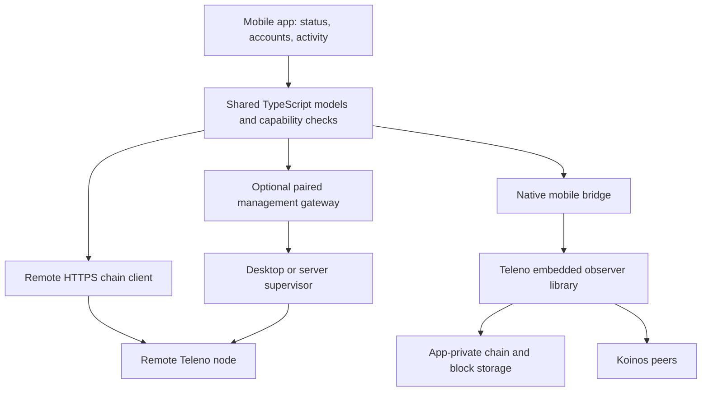

# Teleno on iOS and Android: feasibility and implementation plan

Date: 2026-09-10. Status: **PROPOSED — analysis only; no mobile port implemented.**

This plan covers the native Teleno port, a simplified Koinos One mobile app,
and publication through Apple's App Store and Google Play. Policy conclusions
use the official pages linked below, checked on the date above. Engineering
estimates are planning judgments, not measurements or delivery commitments.

## 1. Recommendation

Build a useful mobile companion for both platforms first, and run an embedded
observer feasibility prototype alongside that product work. Develop the shared
native runtime once, then integrate Android before committing to a public iOS
embedded-node release. The iOS dependency and policy probes should nevertheless
start early, so Android work does not conceal an iOS blocker.

The companion should monitor a user-selected Teleno node, show KOIN/VHP/Mana
and account activity, and make connection health understandable. Begin with
watch-only accounts. Add a non-custodial wallet only as an independently tested
increment. Remote producer monitoring is useful without putting production
keys or the block-production loop on the phone.

**A companion app is not a port of the node.** The embedded track below is the
actual port: it runs Teleno's chain execution, storage, and P2P code on the
device. Its first product contract should be explicit, interruptible observer
sessions. A continuously available smartphone producer is not a credible
baseline for this project.

### Feasibility by product variant

These ratings are engineering/review-risk assessments, not store decisions.
The policy grounds are detailed in section 8.

| Variant | iOS | Android | Product decision |
| --- | --- | --- | --- |
| Remote companion, watch-only accounts | High technical feasibility; credible store path | High technical feasibility; credible store path | Recommended first release |
| Non-custodial wallet using remote RPC | Feasible; custody, publisher, and regional scope need review | Feasible; declarations and regional scope need review | Separate increment after watch-only MVP |
| Embedded observer during explicit sessions | Technically plausible; WASM policy, dependency licensing, resources, and lifecycle remain gates | Technically plausible; native builds, resources, and lifecycle remain gates | Prototype on both; mature Android first |
| Continuously available background observer | No reliable general-purpose daemon contract | Restricted and device-dependent; a foreground service is not an uptime guarantee | Exclude from normal phone promises |
| On-device block production | Very high publication risk and poor availability fit | Very high Play publication risk; dedicated-device experiments are a separate question | Exclude from store release scope |
| Genuine protocol-verifying light client | No implementation established by this review | Same | Separate protocol research, not a build option |

No portable build, device resource profile, App Review decision, or Play review
decision was produced in this analysis. The feasibility work must resolve those
unknowns before an embedded-node release is promised.

## 2. Verified starting point

The inspected Teleno checkout is `6652556bc5cf4884f7c4a20aa4ec24d409181f3d`,
with `VERSION` equal to `1.3.0-dev.0`. The existing root README modification and
untracked high-throughput plan are unrelated to this proposal. Koinos One was
read at clean checkout `1e844159973765615f72bd35c6c546f739322c66`; its app version
is `1.2.0-dev.0`. These are source identities, not mobile binary identities.

| Current evidence | Consequence for the port |
| --- | --- |
| [CMake entrypoint](../../CMakeLists.txt) uses C++20 and resolves native dependency packages. [Component targets](../../src/CMakeLists.txt) already separate chain, storage, VM, P2P, RPC, and other services. | Reuse the implementation; a protocol rewrite is unnecessary. Existing component libraries are a useful foundation, but are not an embeddable SDK. |
| [main.cpp](../../src/main.cpp) is 2,241 lines and owns construction, indexing, threads, signals, producer keys, diagnostics, and shutdown. | Extract runtime ownership and cancellation from the executable before embedding it in an app process. |
| [The build script](../../scripts/build-cpp-libp2p-koinos.sh) prepares host-oriented Hunter dependencies, static libraries, and patched cpp-libp2p. No iOS/Android build or CI target was found in the inspected build surfaces. | Cross-compile the complete dependency graph. Existing macOS arm64 archives cannot be linked into an iOS app merely because the CPU architecture matches. |
| [Go bridge transport](../../src/p2p/go_bridge_transport.cpp) uses `fork()` and `execv()`. [Native transport](../../src/p2p/libp2p_transport.cpp) provides a C++ implementation. | Exclude the Go helper path from mobile artifacts and qualify the native transport on each platform. |
| [Fizzy integration](../../src/koinos/vm_manager/fizzy/fizzy_vm_backend.cpp) parses and executes contract WASM, meters execution, and restricts host calls. | Keep its semantics. Downloaded contract execution needs a distinct store review analysis even with an interpreter. |
| [Configuration](../../src/core/config.hpp) defaults include a 256 MiB RocksDB block cache, 256 MiB aggregate DB write-buffer setting, 64 MiB per-buffer setting, and 20 target peers. [State object cache](../../src/koinos/state_db/backends/rocksdb/rocksdb_backend.cpp) has a hard-coded 64 MiB accounting limit. | Desktop defaults are unsuitable as an assumed mobile profile. These settings are neither measured RSS nor a complete process memory cap. |
| The VM module cache holds 32 entries, not a byte budget. | Include parsed modules and execution instances in resource accounting. |
| [RPC documentation](../rpc-endpoints.md) describes a broad default JSON-RPC listener and a separate local backup admin API. | Embedded UI calls should remain in process; the mobile build should open no RPC/admin listener by default. |
| [Service coverage](https://github.com/koinos/koinos-one/blob/1e844159973765615f72bd35c6c546f739322c66/docs/manual/developers/deeper-references/monolith-service-coverage.md) identifies partial history and metadata coverage. | An empty history response must not be presented as proof of no activity. |
| [Koinos One package](https://github.com/koinos/koinos-one/blob/1e844159973765615f72bd35c6c546f739322c66/package.json) uses Electron, React DOM, TypeScript, and koilib. [Bridge design](https://github.com/koinos/koinos-one/blob/1e844159973765615f72bd35c6c546f739322c66/docs/manual/developers/gui/app-state-and-native-bridge.md) exposes privileged operations through Electron IPC. | Reuse selected domain logic and interaction patterns, then replace the desktop platform layer. Electron packaging and process orchestration do not become mobile features automatically. |
| [Remote service](https://github.com/koinos/koinos-one/blob/1e844159973765615f72bd35c6c546f739322c66/electron/lib/remote-node-service.ts) invokes child processes; [wallet service](https://github.com/koinos/koinos-one/blob/1e844159973765615f72bd35c6c546f739322c66/electron/lib/wallet-service.ts) depends on injected desktop storage and signing services. | Neither is a ready mobile management API or a reviewed mobile keystore. |

### Existing correctness work is on the embedded critical path

The [software audit](../performance/teleno-software-audit.md) records reproduced
storage error handling and atomicity failures, RPC sessions surviving stop,
cache hangs, and optional-index inconsistencies. The
[remediation plan](teleno-audit-remediation-plan.md) remains proposed. The current
checkout retains that status; this review did not rerun its reproductions.

WP1 storage integrity, WP2 lifecycle, and WP3 cache correctness should precede
an embedded beta. Phone termination and memory pressure amplify precisely
these failure modes. A harness can expose them before fixes, but it cannot
establish release readiness. Optional indexes used by the app also need their
relevant fixes and coverage, or must remain unavailable in the mobile profile.
The existing remediation TODO remains open; this planning task does not start
its implementation.

## 3. Simplified Koinos One mobile product

### First release: useful without a local blockchain database

| Surface | Initial behavior | Later extension |
| --- | --- | --- |
| Home | Selected network and node, last refresh, head/LIB, health, watch-only balances | Optional notifications from a consented monitoring service |
| Node | Add an HTTPS endpoint; inspect its identity, connectivity, and capabilities; see available health data | Pair with the user's Koinos One installation; explicit local observer sessions |
| Accounts | Add public addresses, show KOIN/VHP/Mana, copy/share a receive address or QR, show available activity | Reviewed non-custodial signing and transfers |
| Activity | Transaction/block details, pending versus confirmed/final status, data-source attribution | Richer history when a compatible index is available |
| Settings | Network/endpoints, privacy, connection removal, support, licenses, version | Local storage quota, Wi-Fi policy, session settings |

Retain Koinos One's visual language while designing navigation, forms,
accessibility, text scaling, and touch targets for phones. Do not transplant the
desktop's full settings screen. Source selection and stale data must remain
visible: `Remote node`, `Local validation in progress`, `Validated through
height ...`, and `History unavailable` represent different guarantees.

The initial app does not need a platform account. Manual endpoint setup should
work before a desktop pairing feature exists. Public chain RPC alone cannot
provide private CPU/disk/process metrics; capability detection must hide or
explain unavailable fields. QR pairing, notifications, and richer node health
require additional infrastructure and are explicitly scheduled below.

Keep native builds, repository cloning, shell commands, SFTP administration,
restore activation, arbitrary RPC consoles, VHP burns, producer-key management,
and production activation outside the first mobile release. Remote production
status can be displayed without exposing those operations. Pool discovery and
allocation workflows can be a later product increment after their data and
transaction contracts are specified.

### App framework decision

| Choice | Reuse and benefit | Cost and limitation |
| --- | --- | --- |
| React Native with TypeScript and native modules | Reuses React knowledge, pure TypeScript models, formatters, validation, and selected tests; supports a shared C++ module | React DOM components/CSS need adaptation; OS lifecycle and key handling still need native work |
| Capacitor with a redesigned React web UI | Reuses more existing DOM components; practical for a companion-focused launch | Still needs native plugins for the node and secure operations; a WebView does not keep background work alive |
| SwiftUI plus Kotlin/Compose | Direct access to each platform's UI and lifecycle | Two UI implementations and less reuse of the current app |

**Recommended:** React Native if the embedded-node track is a strategic part of
the product. Prefer Capacitor if the team deliberately chooses a companion-only
scope and maximum web UI reuse. Both support native integration; neither solves
the storage or scheduling problem. This judgment follows the existing app
architecture and the documented
[React Native C++ module path](https://reactnative.dev/docs/the-new-architecture/pure-cxx-modules)
and [Capacitor plugin model](https://capacitorjs.com/docs). Do not promise a reuse
percentage before extracting and testing the actual modules.

## 4. Architecture and trust boundaries



The chain data interface can have remote and embedded implementations. Define
capabilities, network identity, read-only queries, cancellation, and observation
timestamps explicitly. It must not silently replace a failed local validation
with remote data while continuing to label the result locally verified.

A remote RPC response remains a statement from that server. Comparing multiple
servers can reveal disagreement, but does not create a trustless light client.
A node restored from a signed checkpoint trusts the checkpoint publisher for
the starting state unless the relevant history is independently validated.
Integrity hashes and publisher signatures do not prove canonical chain state.

A genuine light client needs its own design for consensus/finality verification,
state proofs, historical consensus changes, bootstrap trust, and malicious data
sources. No such path was established in this code review. A pruned validating
node is also a different product from a light client: it still executes and
validates blocks while retaining less historical data.

### Optional remote management

Implement pairing and management as a narrow, authenticated service in the app
or management layer. Teleno remains the node runtime. The current backup admin
API is not a public remote-control API and should stay loopback-bound.

Start with read-only scopes. Use TLS, a short-lived pairing challenge, explicit
network/node identity, device-specific revocable credentials, request limits,
and redacted diagnostics. A gateway should expose named operations and sanitized
status; it should not forward arbitrary shell commands or the entire admin API.
Keep production keys on the node. If remote mutations are later added, require
review of the target and operation, reauthentication, replay protection, an
operation receipt, and server-side confirmation of the resulting state.

For remote alerts, a separately consented observer/gateway watches the node and
sends minimal notifications through APNs/FCM. A suspended phone cannot be the
sole source of continuous monitoring. Document which provider sees endpoints,
addresses, and notification subscriptions; omit account balances and secrets
from notification payloads by default.

## 5. Actual native port

### 5.1 Extract an embeddable runtime

Create a proposed `teleno_runtime` library around existing component targets.
Make `teleno_node` a CLI host for the same runtime. Inject paths, configuration,
logging, scheduling/cancellation, and platform resource signals. Keep CLI
argument parsing, process signals, terminal output, and host administration in
the executable layer.

A small versioned C boundary is suitable for packaging, with an Objective-C++
or C++ adapter on iOS and JNI/C++ integration on Android. Proposed operations:

```text
create(config, platform_services) -> handle
start_async(handle) -> operation_id
request_suspend(handle, reason) -> operation_id
resume_async(handle) -> operation_id
query_async(handle, typed_request) -> result
read_status(handle) -> versioned_status
subscribe(handle, bounded_event_sink) -> subscription
stop_async(handle) -> operation_id
destroy(handle) -> completion
```

Specify ownership and thread rules: no C++ exceptions cross the ABI, callbacks
cannot outlive subscriptions or destruction, bridge values have explicit
lifetimes, and the UI thread never runs replay, compaction, or synchronous RPC.
Native work must continue correctly while a JavaScript runtime is paused or
recreated. Batch status events and bound buffers instead of forwarding every
block/log line into JavaScript.

Use a lifecycle such as `Stopped -> Starting -> Recovering -> Syncing -> Ready`,
with explicit `Suspending`, `Suspended`, `Stopping`, and recoverable error states.
Suspend stops new work and checkpoints progress at a valid persistence boundary.
A cancellation request must return promptly, including during startup indexing.

**Correct recovery cannot depend on receiving a shutdown callback.** The OS
may kill the app before cleanup finishes. Database writes, metadata, replay
progress, and restore staging must recover coherently after abrupt termination.
On reopening, validate the last durable boundary and recover before exposing a
ready state. A persistent merkle mismatch preserves evidence and the existing
database; it does not trigger automatic deletion or a fresh resync.

### 5.2 Turn runtime options into real build boundaries

The current feature map controls runtime startup; it does not remove all linked
code or required dependency discovery. Introduce explicit mobile CMake targets
and options, for example `TELENO_BUILD_EMBEDDED` and component selection flags.
These names are proposed and do not exist today.

For a store observer artifact, omit the producer loop, producer-key creation,
Go helper transport, CLI tools, server listeners, private SFTP backup, and
desktop service administration from the link graph. Retain signature/VRF and
other cryptography needed to validate the protocol. Removing block production
does not establish that those verification dependencies are unnecessary.

Retain chain and required block storage. Assess mempool/gossip dependencies
before disabling transaction admission. Make optional history and metadata
indexes genuinely optional, and decouple in-process query dispatch from the
current network server and its index-library dependencies. Keep a default
desktop build with the existing service surface to prevent mobile packaging
from silently regressing native operation.

### 5.3 Dependency qualification

| Component | Required work | Risk/gate |
| --- | --- | --- |
| C++20, Boost/Asio/log, filesystem, YAML/JSON | Cross-compile; remove host paths and process-only assumptions; provide OS logging and path adapters | Moderate; toolchain and lifecycle qualification |
| Koinos Proto/crypto/util and Protobuf | Separate host `protoc`/generators from target libraries; pin generated-code/runtime compatibility and exact source revisions | Moderate to high; host tools must not be target executables |
| RocksDB plus compression | Build per platform; qualify locks, WAL recovery, flush errors, compaction, storage pressure, and 4/16 KiB OS pages | High; retain read support for compression formats present in accepted snapshots |
| Fizzy and Koinos host API | Preserve metering, traps, limits, and historical execution behavior; run identical bytecode fixtures on all targets | High parity importance; native compilation alone is insufficient |
| Patched cpp-libp2p | Build the repository's patched revision; qualify Noise, peer RPC, gossip, discovery, DNS/IPv6, reconnects, and platform networking | High; upstream support is not proof that this patched dependency graph works |
| OpenSSL, secp256k1/VRF, GMP | Qualify C/assembly targets, entropy, symbols, link order, and cryptographic test vectors; resolve redistribution obligations | High; avoid protocol changes to make packaging easier |
| gRPC, c-ares, re2, abseil | Remove from the mobile dependency graph where unnecessary; check whether generated targets still pull them in | Moderate; a runtime `grpc: false` is insufficient |
| libssh and backup scheduler/admin | Exclude private SFTP/admin services from mobile; retain only selected bootstrap/restore primitives behind app lifecycle | Reduces size and obligations; native download integration remains work |

Fizzy describes itself as a C++ WebAssembly interpreter. That makes a JIT-based
redesign unnecessary for the initial port, but does not settle permission to
execute downloaded contracts. Keep the current execution backend and prove
semantic parity. [Fizzy project](https://github.com/wasmx/fizzy).

### 5.4 Resource and storage profile

Measure complete app memory: native heap, RocksDB caches and memtables, state
objects, fork deltas, parsed WASM, execution instances, P2P buffers, thread
stacks, JavaScript engine, and UI. The prior audit's synthetic cache measurements
are evidence of accounting gaps, not a mobile memory forecast.

Initial **experimental** knobs could be 32–64 MiB shared block cache, 32–64 MiB
aggregate memtable budget, 8–16 MiB object-cache accounting, 1–2 chain workers,
1–2 compaction jobs, and 2–4 outbound peers. These require measurement and some
new configurability. They are not release defaults or hard RSS guarantees.
Correct the cache bugs before adding memory-warning-driven cache eviction.

Store databases in persistent app-private storage, separate by chain ID. Keep
reconstructible chain data out of cloud/device backups and keep keys separate.
Bound logs, in-flight blocks, requests, cached history, and downloaded objects.
Present storage requirements and cancellation before starting a bootstrap.

There is no established mobile pruning contract in the inspected block-store
and configuration paths. Pruning needs a separate implementation: define the
earliest retained height, reorg horizon, startup recovery, peer-serving behavior,
history limits, and checkpoint recovery before deleting historical data. Never
prune reversible state or material needed for consensus validation.

For restore planning, budget for the old database, downloaded snapshot objects,
newly materialized/staged database files, and WAL/compaction reserve at the same
time. A compressed snapshot size alone is insufficient. Reuse and verify the
existing public-bootstrap signature/manifest machinery, with an explicit trust
anchor and observer recovery markers. Qualify cross-platform snapshot opening;
do not assume desktop RocksDB files are portable across arbitrary versions,
options, or compression builds.

Do not reduce consensus limits, skip valid transactions, disable block
verification, or weaken durability to meet a phone budget. If a device cannot
handle a protocol-valid workload, pause with an explicit limitation and offer
remote mode. The official sample profiles already choose full verification;
the mobile profile should set that choice explicitly rather than inherit a
different struct default.

### 5.5 Intermittent use must actually catch up

Let `lambda` be the incoming block/work rate, `mu` the measured sustainable
validation rate while the node runs, and `T_off` the offline time. For a stable
workload with `mu > lambda`:

```text
catch_up_time = lambda * T_off / (mu - lambda)
required_mu / lambda >= (T_on + T_off) / T_on
```

For illustration, running one hour per day requires at least 24 times the live
arrival rate during that hour, before initial bootstrap and safety margin.
This is an illustrative scheduling calculation, not a Koinos throughput
measurement. Measure work/bytes as well as block counts, since contract-heavy
blocks vary greatly in cost. A short foreground demo following the head does
not prove that an intermittently opened phone will remain useful.

## 6. Platform-specific implementation

### iOS

Build the C++ core with the iPhoneOS SDK and separate simulator slices. Package
it with a stable bridge in an XCFramework or equivalent Xcode-integrated target.
Use a macOS build runner, explicit target deployment versions, and store-signed
app bundles; do not download native node binaries at runtime.
[Apple framework packaging](https://developer.apple.com/documentation/xcode/creating-a-multi-platform-binary-framework-bundle).

Implement foreground observer sessions first. Use background transfer APIs for
snapshot downloads, and treat validation/import as separate CPU and storage
work. Evaluate `BGProcessingTask` and, on iOS 26+, `BGContinuedProcessingTask`
for bounded user-requested work with progress, expiration, and cancellation.
Apple's continued-processing API supports work that begins in the foreground;
the system still manages runtime and users can cancel it. It is not evidence
of an entitlement to a permanent node daemon.
[Long-running tasks](https://developer.apple.com/documentation/backgroundtasks/performing-long-running-tasks-on-ios-and-ipados),
[Apple background-task guidance](https://developer.apple.com/videos/play/wwdc2025/227/).

Handle app suspension, memory warnings, thermal pressure, Low Power Mode,
protected-data unavailability while locked, and OS termination. Select file
protection deliberately; do not weaken wallet protection to keep the database
running. Pause sockets and use persistent recovery state. Request local-network
access only if LAN pairing needs it, support IPv6/NAT64, and make outbound P2P
reconnection independent of a stable inbound address.

An initial support-floor proposal is iOS 18+ for the companion, with continued
processing available only on supported newer systems. Device and framework
qualification must confirm the floor; choosing the build SDK does not require
the same minimum deployment OS. Embedded support may need a narrower hardware
matrix than the companion.

### Android

Use the Android NDK and its CMake toolchain, beginning with `arm64-v8a`. Build
an emulator ABI separately where useful. Package the native libraries in the
app/AAB and use JNI or a C++ native module; an Android service still hosts code
inside Android's application/process model. Audit consistent libc++ ownership,
exception/RTTI settings, and position-independent code across the link graph.
[Android NDK CMake guidance](https://developer.android.com/ndk/guides/cmake).

Create a foreground Activity integration first, then assess a user-started
foreground service with a visible progress/stop notification for bounded sync.
Handle process death, Doze, connectivity changes, OEM task termination, service
timeout, force-stop, and reboot without claiming uninterrupted operation.

For apps targeting Android 15+, `dataSync` foreground services have a six-hour
background allowance per 24 hours, with documented reset behavior when the user
returns to the foreground. This rule concerns that service type, not all
foreground services. Implement timeout handling; do not assume another type
such as `specialUse` is an automatically accepted way to run indefinitely.
[Foreground-service timeouts](https://developer.android.com/develop/background-work/services/fgs/timeout).

Use platform transfer/job APIs for resumable downloads when applicable. Their
transfer allowance does not authorize indefinite block execution. Keep node
storage app-private, exclude reconstructible data from device backups, and
avoid broad external-storage permissions. An initial companion floor of
Android 11/API 30 is a product proposal to validate, separate from Play's target
SDK requirement.

Qualify every packaged native library on both 4 KiB and 16 KiB systems. Check
ELF and APK alignment, runtime page-size assumptions, and transitive libraries.
The page-size requirement applies even if the app uses native code indirectly
through its UI framework. The official page currently specifies a February 1,
2027 update-enforcement date; support should be part of the first build, not
deferred to that deadline.
[Android 16 KiB support](https://developer.android.com/guide/practices/page-sizes).

## 7. Wallet security and dependency rights

### Wallet increment

Reuse network definitions, amount formatting, and transaction models only after
testing their mobile behavior. Replace the desktop key-storage and unlocking
layer. Validate address derivation, transaction serialization, signatures,
chain ID, nonce, resource payer/Mana, confirmation text, and finality against
known fixtures and the reference implementation.

Protect account secrets with platform storage and biometric/passcode access.
Keep decrypted key material out of persistent JavaScript state, logs, analytics,
crash attachments, clipboard defaults, and the React bridge wherever possible.
For a native signer, make memory lifetime and zeroization explicit. If secrets
are processed in JavaScript, do not claim reliable immediate zeroization of
garbage-collected copies. Test recovery independently of biometric unlock.

Do not promise hardware-isolated Koinos signing merely because the phone has
a Secure Enclave or StrongBox. The documented Apple API supports NIST P-256,
which differs from Koinos's secp256k1 path; Android StrongBox also documents
P-256 support, not a universal secp256k1 guarantee. Design a protected wrapping
key plus reviewed software signing where necessary, or qualify an external
signer. Explain the difference to users.
[Apple Secure Enclave](https://developer.apple.com/documentation/security/protecting-keys-with-the-secure-enclave),
[Android Keystore](https://developer.android.com/privacy-and-security/keystore).

Keep producer hot keys separate from custody keys and outside the mobile MVP.
Transaction confirmation must show the selected network, signer, destination,
amount, and operation. A remote server must never be able to turn a read query
into an opaque signing request.

### Rights and licenses

Teleno's [LICENSE](../../LICENSE) is MIT. Koinos One's current
[LICENSE](https://github.com/koinos/koinos-one/blob/1e844159973765615f72bd35c6c546f739322c66/LICENSE)
reserves copying, modification, and distribution rights absent permission or a
separate license. Confirm the mobile publisher's rights before extracting app
code or assets. The shared project branding does not establish that all source
has the same license.

The native script builds GMP statically, and the CMake graph explicitly links
it for VRF-related dependencies. GMP 6.3.0 offers LGPLv3 or GPLv2 licensing
options; libssh also has LGPL obligations. A permissive top-level node license
does not replace dependency obligations. Review the exact shipped dependency
versions, notices, source/relinking obligations, signing/distribution terms,
and any exceptions with qualified licensing advice before committing to a
public mobile binary. This is a release gate, not a conclusion that every
LGPL dependency is automatically forbidden in either store.
[GMP copying conditions](https://gmplib.org/manual/Copying),
[libssh licensing](https://www.libssh.org/development/).

Removing mobile SFTP avoids shipping libssh for that feature. Removing GMP may
require a compatible cryptographic implementation and extensive parity review;
disabling the producer alone is not sufficient evidence that it can be removed.
Record an SBOM and license disposition for both mobile artifacts and their
native/UI dependency trees.

## 8. App Store and Google Play feasibility

### Apple: published rules and their application

Apple's relevant published constraints are concise but material:

- Section 3.1.5(ii) restricts cryptocurrency mining to off-device processing.
- Section 3.1.5(i) permits wallet storage apps from organization-enrolled developers.
- Section 2.5.2 restricts downloaded code that changes app functionality; an
  interpreter is not an explicit blanket exception for blockchain contracts.
- Sections 2.4.2 and 2.5.4 address resource use and appropriate background work.
- Sections 2.1, 2.3.1, and 4.2 require reviewable, accurately disclosed, useful
  functionality. Section 3.1 governs paid digital features.

**Assessment:** a useful remote companion has a credible path. On-device PoB
production has very high rejection risk; the rules do not expressly exempt PoB.
An observer avoids producing rewards, but downloaded contract execution remains
an unresolved review issue. Explain WASM validation and its restricted host API
to App Review using a concrete build. Treat feedback as guidance, not guaranteed
approval. Do not conceal execution behind the label “blockchain data.”
[App Review Guidelines](https://developer.apple.com/app-store/review/guidelines/).

Demonstrate that contract execution cannot load native libraries or access
platform/UI services. That technical boundary supports the review explanation;
it does not establish an exemption.

### Google Play: published rules and their application

Google prohibits on-device cryptocurrency mining and permits remote mining
management. Its blockchain policy also requires relevant tokenized-asset
disclosures and restricts promotion of potential earnings from playing or
trading. **Assessment:** remote node/producer monitoring has a credible path;
on-device PoB production is a very high-risk release feature because no explicit
PoB exception is stated. Low CPU consumption does not establish an exception.
[Blockchain-based content](https://support.google.com/googleplay/android-developer/answer/13607354?hl=en).

Google's country-specific exchange/software-wallet guidance explicitly places
non-custodial wallets outside that specific policy's scope. That does not remove
other Play requirements or applicable law. Custody, exchange, fiat services,
or managed earning products need a separate assessment of features and launch
territories. In particular, do not tell the project that a purely non-custodial
wallet automatically requires the same country registrations as an exchange.
[Exchange and wallet policy guidance](https://support.google.com/googleplay/android-developer/answer/16329703?hl=en).

Play restricts self-updates and downloaded native executables, and includes an
interpreter/VM exception subject to the rest of its policies. Teleno's exact
WASM behavior needs documentation and review under that rule. Foreground
services must have justified types, user-visible purpose and control, and run
only as needed; declaration evidence may include a demonstration video.
**Assessment:** package native code through Play and evaluate bounded observer
sessions. Review P2P relay behavior under the same policy's proxy-service
restrictions; disable optional general relay service in the phone profile.
A foreground service does not establish continuous uptime.
[Device/network and foreground-service policy](https://support.google.com/googleplay/android-developer/answer/16559646?hl=en).

### Submission requirements to schedule

| Requirement | Implementation/release action |
| --- | --- |
| Publisher identity | Use the authorized organization for the wallet product. Google also directs financial-service publishers toward organization accounts and requires D-U-N-S for organization verification. [Google account types](https://support.google.com/googleplay/android-developer/answer/13634885?hl=en). |
| Current iOS upload toolchain | As checked, uploads require Xcode 26+ with the iOS 26+ SDK, effective April 28, 2026. Recheck at submission; this is distinct from minimum supported device OS. [Apple requirements](https://developer.apple.com/news/upcoming-requirements/). |
| Current Android target SDK | As checked, new apps/updates must target Android 16/API 36+ from August 31, 2026. Do not plan a new release around an assumed extension. [Play target API policy](https://support.google.com/googleplay/android-developer/answer/11926878?hl=en). |
| Privacy disclosures | Publish the actual data flow for RPC queries, addresses, node pairing, diagnostics, and push providers. Complete both [Apple privacy details](https://developer.apple.com/app-store/app-privacy-details/) and [Play Data safety](https://support.google.com/googleplay/android-developer/answer/10787469?hl=en). Public blockchain data can still reveal a user's interests and holdings when queried. |
| Apple native dependency privacy | Audit filesystem/disk and other covered APIs, including third-party libraries, and supply valid reasons/manifests where required. [Required-reason APIs](https://developer.apple.com/documentation/bundleresources/describing-use-of-required-reason-api), [privacy manifests](https://developer.apple.com/documentation/bundleresources/adding-a-privacy-manifest-to-your-app-or-third-party-sdk). |
| Encryption | Complete export classification for the actual TLS, P2P, storage, and signing implementation; do not assume an HTTPS-only exemption covers all of Teleno. [Apple export compliance](https://developer.apple.com/help/app-store-connect/manage-app-information/overview-of-export-compliance/). |
| Financial declarations | Complete the financial-features declaration even if the app declares no financial features; select wallet/other applicable features honestly. This also applies to the specified Play testing tracks. [Financial declaration guidance](https://support.google.com/googleplay/android-developer/answer/13849271?hl=en). |
| Account deletion | If a service account is introduced, implement account/data deletion and retention disclosures. Deleting a service account cannot erase on-chain history. Watch-only addresses do not themselves require inventing a backend account system. [Play deletion requirements](https://support.google.com/googleplay/android-developer/answer/13327111?hl=en). |
| Test access | Plan TestFlight and Play testing with reviewable non-secret access. If using a new personal Play account, the stated closed-test gate is 12 opted-in testers for 14 continuous days before applying for production access; it is not a universal organization-account requirement. [Play testing rules](https://support.google.com/googleplay/android-developer/answer/14151465?hl=en). |

### Store strategy

Submit the companion as a complete, useful product. Keep the native observer
in a separately reviewed increment until runtime, rights, and resource gates
pass. Produce a review packet showing the app modes, a data-flow diagram,
contract execution boundaries, actual permissions, measured resource use,
publisher rights, and steps that reviewers can complete without a long chain
download or access to a private producer.

If an embedded observer is rejected, retain the companion release while
resolving the specific objection or appealing with evidence. A simulator build
or TestFlight acceptance does not prove public store eligibility. Android
distribution outside Play may be considered for an experimental node, but is
a separate distribution/security/update project and does not remove OS limits.
Alternative iOS distribution likewise needs its own eligibility analysis.

The first release should be free of exchange, custody, paid mining, and yield
products. This narrows the engineering and product scope. Any later paid app
features, hosted services, or token transactions need their own current
storefront/payment-policy assessment; using cryptocurrency is not a general
substitute for platform billing. Launch territories should follow the actual
service model, with legal review where regulated services are introduced.

## 9. Implementation work packages

All package paths below are proposed. Estimates use **engineer-weeks of work**,
including component tests and integration, and may overlap only with sufficient
staff. They exclude unpredictable external review time. Work proceeds after a
separate implementation request; no phase is being executed by this document.

| Package | Scope, repository ownership, and deliverable | Dependency / exit gate | Effort |
| --- | --- | --- | --- |
| M0 — feasibility evidence | Teleno: exact dependency/license manifest; minimal Android and iOS native harnesses with storage, VM, crypto, and transport probes. App owner: publisher/reuse rights, target users/devices, store review explanation. | Record real build/link failures and device results; decide which embedded blockers are tractable. Seek policy clarification where available without assuming preapproval. | 4–6 |
| M1 — companion app | Koinos One mobile app: domain/transport interfaces, phone UI, HTTPS endpoints, watch-only accounts, capability-aware activity and health, accessibility, local preferences, release automation. | M0 product/rights decisions; useful operation on both OSes, including stale/incorrect endpoints. Does not depend on an embedded core. | 8–12 |
| M2 — shared native foundation | Teleno: prerequisite WP1–WP3 work, runtime extraction, cancellation, build-time component separation, host/target dependency builds, ABI and desktop regression coverage. | M0 native feasibility; no persistence/lifecycle/cache release blockers; desktop behavior preserved. | 10–16 |
| M3 — Android observer | Teleno: NDK artifact. Mobile app: native adapter, session service, storage/bootstrap UI, reconnects, interruption handling, resource instrumentation. | M2; Android hardware parity, kill/reopen, resource and 16 KiB gates. | 6–10 |
| M4 — iOS observer | Teleno: iOS artifact. Mobile app: native adapter, app lifecycle, data protection, bounded work/download integration, device resource qualification. | M2 and early iOS policy/license evidence; reviewable observer with acceptable catch-up behavior. May overlap M3 with another engineer. | 8–12 |
| M5 — embedded release qualification | Both repositories: representative historical validation, adversarial fixtures, long interruption/thermal runs, package/license verification, beta fixes, store review packet. | M3/M4 for each platform; all release gates below. | 6–10 |
| O1 — mobile wallet | App: native/platform secret handling, recovery, signing, confirmations, independent security review and regional scope. | M1 plus rights/publisher decisions; testnet and recovery gates before a production wallet release. | Additional 6–10, plus external review |
| O2 — pairing and remote alerts | App/management layer: desktop pairing, authenticated read-only gateway, revocation, sanitized node health, optional APNs/FCM relay. | M1; explicit operational/data ownership and endpoint isolation. | Additional 4–8, plus ongoing service operations |
| O3 — retention or true light verification | Teleno/protocol work: specify missing retention/proof contracts, implement and validate as separate capabilities. | Only if M0/M3 measurements show the unpruned design misses the product budget. | Re-estimate after design; not included above |

The complete base program M0–M5 is roughly **42–66 engineer-weeks**. A team with
one C++/storage engineer, one mobile engineer, and part-time QA/design can plan
approximately **6–9 months** for both embedded variants if the gates pass;
policy rejection, cryptographic dependency replacement, or pruning could extend
that substantially. The companion can target a **10–16 week** release track
with that staffing and overlapping feasibility work. A solo implementation
should be planned substantially longer, approximately **10–16 months** for the
base embedded scope, before optional capabilities or major blockers.

These estimates assume existing Koinos protocol expertise, access to suitable
test devices and a representative chain corpus, no consensus rewrite, and no
custodial service. Re-estimate after M0 using measured port failures. For a
financial budget, multiply the selected packages by actual loaded team rates
and add device/CI, publisher, legal/security review, and optional relay costs;
no rate or spending budget is assumed here.

### First implementation sequence

1. Agree the initial companion/observer scope and publisher rights; select the
   oldest supported iPhone and at least one midrange Android test device.
2. Pin source/dependency revisions and build a minimal native harness on each
   target; exercise a real VM invocation, RocksDB write/reopen, crypto vectors,
   and native peer connection rather than stopping at a link-only demo.
3. Record device memory, disk, thermal, and catch-up results; submit concrete
   policy questions about observer WASM and keep producer code outside the
   intended store artifact.
4. Start the companion domain/UI work while implementing the approved native
   prerequisites. Preserve a deployable companion if the embedded track stops.
5. Stabilize Android observer sessions, then qualify iOS and both store builds
   against the same chain corpus and release gates.

## 10. Verification and release gates

| Gate | Required evidence | Failure action |
| --- | --- | --- |
| G0 — build and rights | Clean reproducible cross-builds; exact dependency revisions/SBOM; licensed app reuse and distributable native link graph | Resolve dependency/right issues or keep companion-only artifacts |
| G1 — protocol parity | Same block IDs, receipts, metering, state roots, and LIB/fork outcomes against the reference over a fixed corpus; historical exception and invalid-input cases | Stop embedded release; do not relax validation |
| G2 — interruption integrity | Repeated process kills during block writes, indexing, WAL/flush, compaction, and bootstrap activation; retry/reopen consistency and preserved recovery markers | Fix durability/lifecycle or keep prototype-only |
| G3 — resource viability | Whole-app memory, bytes written/day, bootstrap peak disk, steady sync, thermal behavior, and catch-up on the minimum device | Narrow supported devices or implement measured optimizations/retention |
| G4 — network resilience | Wi-Fi/cellular changes, metered/offline policy, IPv6/NAT64, wrong-chain peers, reconnect storms, partial responses, malicious peers, clock changes | Fix transport and source attribution before beta |
| G5 — user trust and keys | Explicit local/remote state, incomplete history handling, isolated credentials, verified recovery/signatures if wallet enabled, no producer path in observer package | Remove incomplete feature or remediate |
| G6 — store artifact | Tests of installed release builds; permissions, manifests, signatures, symbol files, SDK/page-size checks; reviewer access and accurate feature disclosures | Delay that artifact, preserve a separately valid companion release |

Suggested initial **acceptance targets**, to confirm in M0 rather than present
as achieved performance:

- At least one older supported iPhone, a contemporary iPhone, a midrange Android
  device, and a 16 KiB Android environment; simulators supplement real devices.
- A provisional embedded budget of under 500 MiB steady whole-app memory and
  under 800 MiB during replay on the agreed minimum devices, revised against
  observed OS pressure. No universal iOS memory-kill threshold is assumed.
- A 24-hour foreground/allowed-session soak with no unbounded growth, plus a
  multi-day intermittent-use run that demonstrates the promised catch-up window.
- At least 100 randomized kill/reopen cycles per platform spanning persistence
  and lifecycle states, plus deterministic injected failures at known boundaries.
- Prompt cancellation acknowledgement (target under one second), with a tested
  recovery path when safe shutdown cannot finish within OS-granted time.
- No thermal critical state under the supported workload; pause/reduce optional
  work on thermal warnings. Record battery and storage writes before setting
  public battery-life claims.

The memory targets are product acceptance hypotheses, not reasons to reject
otherwise protocol-valid blocks. If valid worst-case workloads exceed them,
the support contract or product mode must change. The audit's existing CTest
results do not replace these gates. During native implementation, run focused
tests, broader CTest for shared changes, reference replay, and binary identity/
CLI smoke checks; mobile device tests must exercise the installed release code.

## 11. Repository and release ownership

Teleno owns the reusable runtime, C/C++ boundary, native dependency builds,
protocol/storage tests, mobile native artifacts, native versioning, and CLI
documentation. Suggested additions include `src/runtime/`, `include/teleno/`,
`cmake/mobile/`, platform build scripts, and mobile harness tests.

Koinos One owns the app and management layer. A proposed `mobile/` workspace
and a narrowly extracted TypeScript domain package can live there after the
rights and repository-layout decision. A separate mobile repository is also
possible, but should not duplicate consensus code. This document makes no
changes to the desktop application or its submodule pin.

Publish versioned native artifacts with exact Teleno commit, build options,
dependency lock, ABI version, symbol files, and license notices. The mobile
consumer deliberately pins those artifacts; desktop and mobile products keep
independent release versions. Recheck store policy and toolchain requirements
for each submission. Preserve the existing desktop/native release gates and
update affected manuals when behavior actually changes.

## 12. Decisions to make after the feasibility prototype

The recommended defaults are a watch-only companion, React Native for the
longer-term embedded strategy, explicit observer sessions, and off-device
production. The prototype should determine whether the native memory/storage
budget and intermittent catch-up are realistic, whether iOS contract execution
is reviewable, and whether the dependency licenses permit the intended build.

If those gates pass, proceed with the staged native port. If they fail, the
companion remains a useful product, and a dedicated light-client or retention
project can be evaluated using measured evidence. Neither outcome should be
described as a completed mobile full-node port before the native gates pass.
