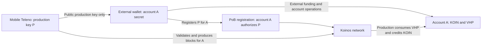
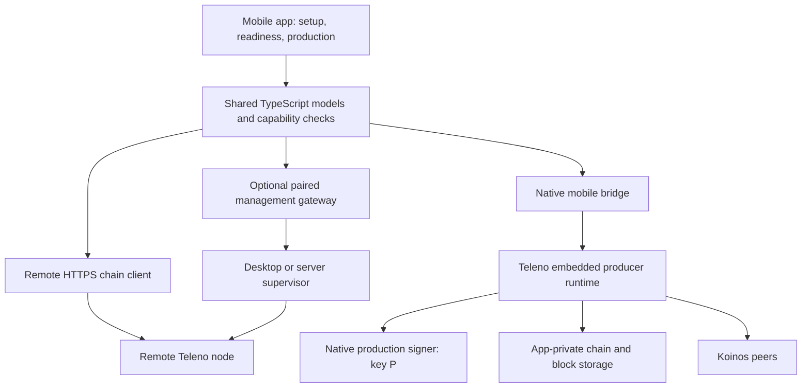

# Teleno on iOS and Android: producer feasibility and implementation plan

Date: 2026-09-10. Status: **PROPOSED — analysis only; no mobile implementation or store approval.**

Spanish translation: [Español](teleno-mobile-feasibility-and-implementation-plan.es.md).

This plan covers an embedded Teleno producer, a minimal mobile app with external
funds custody, and publication through Apple's App Store and Google Play with
an individual publisher where eligible. It consolidates product decisions,
technical implementation, and distribution gates in one document. Policy and
fee sources were checked on the date above; estimates and acceptance targets
are planning judgments, not measured results or delivery commitments.

## 1. Product objective and feasibility

Build a minimal app that runs Teleno and produces **Koinos Proof of Burn (PoB)**
blocks on the phone, while the user controls KOIN/VHP through an external
wallet. The app owns only a separate production key. A useful prototype must
produce a block accepted by an independent reference node, not merely display
remote status or synchronize as an observer.

PoB is the working consensus assumption because the requested funding model
uses VHP. Teleno selects `pob` or `federated` and does not implement Proof of
Work. A literal PoW requirement would require a separate consensus/network
project; it cannot be introduced as a mobile packaging option.

| Area | Assessment | Required evidence or decision |
| --- | --- | --- |
| Production with external funds custody | Supported by the existing separation of producer address and signing key | Mobile secure signer, externally authorized registration, effective VHP, and real PoB production |
| Embedded producer on iOS/Android | Plausible engineering prototype; no mobile build or device production established | Cross-builds, reference parity, interruption recovery, eligible uptime, storage and thermal measurements |
| Both public stores with an individual publisher | No established release path for the proposed local producer | Correct account type and review of the fully disclosed feature set; neither mining rule expressly exempts PoB |
| Continuous phone production | Not a credible default availability promise | A supported operating mode must demonstrate useful production despite suspension and catch-up |
| App managing an off-device producer | More credible distribution and availability path | A separate product decision and authenticated management implementation; not completion of local production |

Prioritize native producer feasibility and store classification before a broad
app build. Integrate Android first after shared foundations, while running the
iOS dependency, lifecycle, and policy probes early. Start and recover every
node as an observer; enable production only after explicit user action and
readiness checks. Observer mode is a safety state of this producer product.

Exclude an internal funds wallet, exchange, burns, general portfolio, and
arbitrary transaction signing from the app. Removing those features reduces
scope, but does not resolve device-mining restrictions or the cost of porting
the full validating runtime. Section 8 separates enrollment from eligibility;
section 12 records the deployment alternatives.

## 2. Verified starting point

The inspected Teleno checkout is `299a0bfc151bca7c8727cfadabfdc21ebc19046d`,
with `VERSION` equal to `1.3.0-dev.0`. Its native source is unchanged from
`6652556bc5cf4884f7c4a20aa4ec24d409181f3d`. Koinos One was read at
`1e844159973765615f72bd35c6c546f739322c66`, app version `1.2.0-dev.0`.
These are source identities, not mobile binary identities.

| Current evidence | Consequence for the port |
| --- | --- |
| [CMake entrypoint](../../CMakeLists.txt) uses C++20 and resolves native dependency packages. [Component targets](../../src/CMakeLists.txt) already separate chain, storage, VM, P2P, RPC, and other services. | Reuse the implementation; a protocol rewrite is unnecessary. Existing component libraries are a useful foundation, but are not an embeddable SDK. |
| [main.cpp](../../src/main.cpp) is 2,241 lines and owns construction, indexing, threads, signals, producer keys, diagnostics, and shutdown. | Extract runtime ownership and cancellation from the executable before embedding it in an app process. |
| [The build script](../../scripts/build-cpp-libp2p-koinos.sh) prepares host-oriented Hunter dependencies, static libraries, and patched cpp-libp2p. No iOS/Android build or CI target was found in the inspected build surfaces. | Cross-compile the complete dependency graph. Existing macOS arm64 archives cannot be linked into an iOS app merely because the CPU architecture matches. |
| [Go bridge transport](../../src/p2p/go_bridge_transport.cpp) uses `fork()` and `execv()`. [Native transport](../../src/p2p/libp2p_transport.cpp) provides a C++ implementation. | Exclude the Go helper path from mobile artifacts and qualify the native transport on each platform. |
| [Fizzy integration](../../src/koinos/vm_manager/fizzy/fizzy_vm_backend.cpp) parses and executes contract WASM, meters execution, and restricts host calls. | Keep its semantics. Downloaded contract execution needs a distinct store review analysis even with an interpreter. |
| [Configuration](../../src/core/config.hpp) defaults include a 256 MiB RocksDB block cache, 256 MiB aggregate DB write-buffer setting, 64 MiB per-buffer setting, and 20 target peers. [State object cache](../../src/koinos/state_db/backends/rocksdb/rocksdb_backend.cpp) has a hard-coded 64 MiB accounting limit. | Desktop defaults are unsuitable as an assumed mobile profile. These settings are neither measured RSS nor a complete process memory cap. |
| The VM module cache holds 32 entries, not a byte budget. | Include parsed modules and execution instances in resource accounting. |
| [RPC documentation](../rpc-endpoints.md) describes a broad default JSON-RPC listener and a separate local backup admin API. | Embedded UI calls should remain in process; the mobile build should open no RPC/admin listener by default. |
| [Service coverage](https://github.com/koinos/koinos-one/blob/1e844159973765615f72bd35c6c546f739322c66/docs/manual/developers/deeper-references/monolith-service-coverage.md) identifies partial history and metadata coverage. | An empty history response must not be presented as proof of no activity. |
| [Koinos One package](https://github.com/koinos/koinos-one/blob/1e844159973765615f72bd35c6c546f739322c66/package.json) uses Electron, React DOM, TypeScript, and koilib. [Bridge design](https://github.com/koinos/koinos-one/blob/1e844159973765615f72bd35c6c546f739322c66/docs/manual/developers/gui/app-state-and-native-bridge.md) exposes privileged operations through Electron IPC. | Reuse selected domain logic and interaction patterns, then replace the desktop platform layer. Electron packaging and process orchestration do not become mobile features automatically. |
| [Remote service](https://github.com/koinos/koinos-one/blob/1e844159973765615f72bd35c6c546f739322c66/electron/lib/remote-node-service.ts) invokes child processes; [wallet service](https://github.com/koinos/koinos-one/blob/1e844159973765615f72bd35c6c546f739322c66/electron/lib/wallet-service.ts) depends on injected desktop storage and signing services. | Neither is a ready mobile management API or a reviewed mobile keystore. |

### Existing correctness work is on the embedded critical path

The [software audit](../performance/teleno-software-audit.md) records reproduced
storage error handling and atomicity failures, RPC sessions surviving stop,
cache hangs, and optional-index inconsistencies. The
[remediation plan](teleno-audit-remediation-plan.md) remains proposed. The current
checkout retains that status; this review did not rerun its reproductions.

WP1 storage integrity, WP2 lifecycle, and WP3 cache correctness should precede
an embedded beta. Phone termination and memory pressure amplify precisely
these failure modes. A harness can expose them before fixes, but it cannot
establish release readiness. Optional indexes used by the app also need their
relevant fixes and coverage, or must remain unavailable in the mobile profile.
The existing remediation TODO remains open; this planning task does not start
its implementation.

### Producer and contract evidence

Teleno's [producer configuration](../../src/block_production/block_producer.hpp)
separates `producer_address` from the signing key. The
[implementation](../../src/block_production/block_producer.cpp) loads or creates
a WIF key, implements PoB VRF/block signing, and exposes a key-derived address
distinct from the configured funding/reward account.

The inspected [PoB contract](https://github.com/koinos/koinos-one/blob/1e844159973765615f72bd35c6c546f739322c66/vendor/koinos/koinos-contracts-as/contracts/pob/assembly/Pob.ts)
requires the producer account to authorize key registration, uses the registered
key for proofs, and applies VHP consumption/KOIN rewards to that account.
The [VHP contract](https://github.com/koinos/koinos-one/blob/1e844159973765615f72bd35c6c546f739322c66/vendor/koinos/koinos-contracts-as/contracts/vhp/assembly/Vhp.ts)
supports authorized transfers and delays effective balance increases. No new
custody contract or consensus change is needed for the proposed separation.

These contract findings describe inspected source, not a fresh audit matching
it to deployed WASM. Verify the selected network's contract identity,
parameters, registration, and effective balances before activation. Follow the
[producer activation guide](../running-producer-node.md).

## 3. Minimal app and external funds custody

Use two separate identities:

| Identity | What it controls | Where its secret lives |
| --- | --- | --- |
| Account A: funding and rewards address | KOIN/VHP transfers, external burns, production-key registration/replacement | The user's external wallet; never imported into the producer app |
| Key P: production key | PoB VRF proofs and block signatures for account A after registration | The device running Teleno, protected through its native key-storage layer |



Proposed onboarding:

1. The user creates or selects **account A in an external wallet**, then imports
   only its public address into the app and selects the network.
2. The app deliberately generates **production key P**. It shows the public key
   and a registration summary/QR containing the network and account A. A QR or
   deep link requires a supported external signing flow; its existence must be
   verified rather than assumed.
3. In the external wallet or compatible CLI, the user registers P for A. The
   user also transfers VHP to A or performs an external KOIN-to-VHP burn with A
   as beneficiary, and maintains the liquid KOIN/Mana needed for account
   operations. The app neither signs these transactions nor requests A's secret.
4. The app follows the chain and distinguishes current VHP from **effective VHP**
   and registration from **active registration**. The inspected contracts use
   20-block delays for key activation and VHP increases. Check actual network
   state and registration inclusion; do not use a fixed wall-clock countdown
   or treat `get_public_key` alone as proof that the key is active.
5. After local observer readiness and all production checks pass, the user
   explicitly starts production. The app displays session availability and
   canonical block results. Losing readiness returns it to a safe paused state.
6. Rewards remain in A. Transfers, VHP replenishment, key replacement, and
   revocation remain external. Lost-device recovery generates a replacement
   production key and re-registers it externally; it does not restore a funds
   wallet inside the app.

The node can generate P, but **the address derived from P must not be presented
as the funding address**. Funding that address would defeat the separation.
If creating the funds account on the phone is essential, account creation,
secret export, recovery, and wallet classification must be reconsidered; that
is not the recommended minimal design.

The PoB registration grants production authority, not ordinary spending
authority over a separate account A. This assumes the account's authorization
rules do not separately grant P spending rights. Production still consumes
VHP and credits KOIN under consensus rules, so “no internal wallet” must not
be described as “no financial effects.”

### App surfaces

The proposed app needs four surfaces: setup with public account and production
key; node synchronization/readiness; explicit start/pause with production
results; and settings for storage, network, session limits, diagnostics, and
external key recovery. Show only balances needed to explain readiness and
production results. Do not add a general funds wallet, portfolio, exchange,
burn interface, or arbitrary transaction signer.

The app needs no platform account. Keep source freshness, selected network,
local validation height, registration status, and the reason production is
paused visible. General account history is outside the initial product; if a
later feature uses partial indexes, unavailable history must not mean no activity.

### App framework decision

React Native with TypeScript and native modules is a reasonable shared-UI
default for the embedded producer. Keep consensus, scheduling, and signing
native. SwiftUI plus Kotlin/Compose is an alternative with direct platform
integration and two UI implementations. Capacitor is more attractive if a
separate decision selects a remote-management product and greater web UI reuse.
None changes the storage or background-execution limits.
[React Native C++ modules](https://reactnative.dev/docs/the-new-architecture/pure-cxx-modules),
[Capacitor plugins](https://capacitorjs.com/docs).

Design a small original phone UI; it need not reproduce Koinos One's wallet or
desktop workflows. Reuse pure domain logic only after rights and mobile
behavior checks. Do not promise a reuse percentage before examining the modules.

## 4. Architecture and trust boundaries



The chain data interface can have remote and embedded implementations. Define
capabilities, network identity, read-only queries, cancellation, and observation
timestamps explicitly. It must not silently replace a failed local validation
with remote data while continuing to label the result locally verified.

A remote RPC response remains a statement from that server. Comparing multiple
servers can reveal disagreement, but does not create a trustless light client.
A node restored from a signed checkpoint trusts the checkpoint publisher for
the starting state unless the relevant history is independently validated.
Integrity hashes and publisher signatures do not prove canonical chain state.

A genuine light client needs its own design for consensus/finality verification,
state proofs, historical consensus changes, bootstrap trust, and malicious data
sources. No such path was established in this code review. A pruned validating
node is also a different product from a light client: it still executes and
validates blocks while retaining less historical data.

### Optional remote management deployment

If the off-device alternative in section 12 is selected, implement pairing and
management as a narrow, authenticated service in the app
or management layer. Teleno remains the node runtime. The current backup admin
API is not a public remote-control API and should stay loopback-bound.

Start with read-only scopes. Use TLS, a short-lived pairing challenge, explicit
network/node identity, device-specific revocable credentials, request limits,
and redacted diagnostics. A gateway should expose named operations and sanitized
status; it should not forward arbitrary shell commands or the entire admin API.
Keep production keys on the producer host. Adding start/stop control requires
review of the target and operation, reauthentication, replay protection, an
operation receipt, and server-side confirmation of the resulting state.

Remote alerts are optional work outside the initial local producer. A separately
consented observer/gateway watches the node and
sends minimal notifications through APNs/FCM. A suspended phone cannot be the
sole source of continuous monitoring. Document which provider sees endpoints,
addresses, and notification subscriptions; omit account balances and secrets
from notification payloads by default.

## 5. Actual native port

### 5.1 Extract an embeddable runtime

Create a proposed `teleno_runtime` library around existing component targets.
Make `teleno_node` a CLI host for the same runtime. Inject paths, configuration,
logging, scheduling/cancellation, and platform resource signals. Keep CLI
argument parsing, process signals, terminal output, and host administration in
the executable layer.

A small versioned C boundary is suitable for packaging, with an Objective-C++
or C++ adapter on iOS and JNI/C++ integration on Android. Proposed operations:

```text
create(config, platform_services) -> handle
start_async(handle) -> operation_id
request_suspend(handle, reason) -> operation_id
resume_async(handle) -> operation_id
read_producer_readiness(handle) -> versioned_readiness
start_production_async(handle, reviewed_target) -> operation_id
pause_production_async(handle, reason) -> operation_id
query_async(handle, typed_request) -> result
read_status(handle) -> versioned_status
subscribe(handle, bounded_event_sink) -> subscription
stop_async(handle) -> operation_id
destroy(handle) -> completion
```

Specify ownership and thread rules: no C++ exceptions cross the ABI, callbacks
cannot outlive subscriptions or destruction, bridge values have explicit
lifetimes, and the UI thread never runs replay, compaction, or synchronous RPC.
Native work must continue correctly while a JavaScript runtime is paused or
recreated. Batch status events and bound buffers instead of forwarding every
block/log line into JavaScript.

Use a lifecycle such as `Stopped -> Starting -> Recovering -> Syncing -> Ready`,
with explicit `Suspending`, `Suspended`, `Stopping`, and recoverable error states.
Suspend stops new work and checkpoints progress at a valid persistence boundary.
A cancellation request must return promptly, including during startup indexing.

Keep production state separate: `Disabled -> AwaitingRegistration -> Eligible ->
Producing`, with `Paused` and error states. Recheck local chain readiness,
network/account identity, active registration, effective VHP, key availability,
and resource limits before signing. Pause on lost readiness. Suspend/restart
must not silently reactivate production or substitute another key. Production
ABI operations are proposed named controls, not a general-purpose signing API.

**Correct recovery cannot depend on receiving a shutdown callback.** The OS
may kill the app before cleanup finishes. Database writes, metadata, replay
progress, and restore staging must recover coherently after abrupt termination.
On reopening, validate the last durable boundary and recover before exposing a
ready state. A persistent merkle mismatch preserves evidence and the existing
database; it does not trigger automatic deletion or a fresh resync.

### 5.2 Turn runtime options into real build boundaries

The current feature map controls runtime startup; it does not remove all linked
code or required dependency discovery. Introduce explicit mobile CMake targets
and options, for example `TELENO_BUILD_EMBEDDED` and component selection flags.
These names are proposed and do not exist today.

The producer artifact must retain chain validation, block storage, mempool,
native P2P/gossip, VRF, block assembly, and the production loop. Inject the
reviewed native production signer; keep CLI plaintext-key provisioning out of
the app integration. Exclude Go helper transport, CLI tools, server listeners,
private SFTP backup, and desktop service administration from the link graph.

Make optional history and metadata indexes genuinely optional, and decouple
in-process query dispatch from network servers and unnecessary index libraries.
No JSON-RPC, gRPC, or admin listener should open by default in the mobile app.
Keep the desktop build's existing service surface and compatibility checks.
An observer-only artifact would be a separate product, not the producer target.

### 5.3 Dependency qualification

| Component | Required work | Risk/gate |
| --- | --- | --- |
| C++20, Boost/Asio/log, filesystem, YAML/JSON | Cross-compile; remove host paths and process-only assumptions; provide OS logging and path adapters | Moderate; toolchain and lifecycle qualification |
| Koinos Proto/crypto/util and Protobuf | Separate host `protoc`/generators from target libraries; pin generated-code/runtime compatibility and exact source revisions | Moderate to high; host tools must not be target executables |
| RocksDB plus compression | Build per platform; qualify locks, WAL recovery, flush errors, compaction, storage pressure, and 4/16 KiB OS pages | High; retain read support for compression formats present in accepted snapshots |
| Fizzy and Koinos host API | Preserve metering, traps, limits, and historical execution behavior; run identical bytecode fixtures on all targets | High parity importance; native compilation alone is insufficient |
| Patched cpp-libp2p | Build the repository's patched revision; qualify Noise, peer RPC, gossip, discovery, DNS/IPv6, reconnects, and platform networking | High; upstream support is not proof that this patched dependency graph works |
| OpenSSL, secp256k1/VRF, GMP | Qualify C/assembly targets, entropy, symbols, link order, and cryptographic test vectors; resolve redistribution obligations | High; avoid protocol changes to make packaging easier |
| gRPC, c-ares, re2, abseil | Remove from the mobile dependency graph where unnecessary; check whether generated targets still pull them in | Moderate; a runtime `grpc: false` is insufficient |
| libssh and backup scheduler/admin | Exclude private SFTP/admin services from mobile; retain only selected bootstrap/restore primitives behind app lifecycle | Reduces size and obligations; native download integration remains work |

Fizzy describes itself as a C++ WebAssembly interpreter. That makes a JIT-based
redesign unnecessary for the initial port, but does not settle permission to
execute downloaded contracts. Keep the current execution backend and prove
semantic parity. [Fizzy project](https://github.com/wasmx/fizzy).

### 5.4 Resource and storage profile

Measure complete app memory: native heap, RocksDB caches and memtables, state
objects, fork deltas, parsed WASM, execution instances, P2P buffers, thread
stacks, JavaScript engine, and UI. The prior audit's synthetic cache measurements
are evidence of accounting gaps, not a mobile memory forecast.

Initial **experimental** knobs could be 32–64 MiB shared block cache, 32–64 MiB
aggregate memtable budget, 8–16 MiB object-cache accounting, 1–2 chain workers,
1–2 compaction jobs, and 2–4 outbound peers. These require measurement and some
new configurability. They are not release defaults or hard RSS guarantees.
Correct the cache bugs before adding memory-warning-driven cache eviction.

Store databases in persistent app-private storage, separate by chain ID. Keep
reconstructible chain data out of cloud/device backups and keep keys separate.
Bound logs, in-flight blocks, requests, cached history, and downloaded objects.
Present storage requirements and cancellation before starting a bootstrap.

There is no established mobile pruning contract in the inspected block-store
and configuration paths. Pruning needs a separate implementation: define the
earliest retained height, reorg horizon, startup recovery, peer-serving behavior,
history limits, and checkpoint recovery before deleting historical data. Never
prune reversible state or material needed for consensus validation.

For restore planning, budget for the old database, downloaded snapshot objects,
newly materialized/staged database files, and WAL/compaction reserve at the same
time. A compressed snapshot size alone is insufficient. Reuse and verify the
existing public-bootstrap signature/manifest machinery, with an explicit trust
anchor and observer recovery markers. Qualify cross-platform snapshot opening;
do not assume desktop RocksDB files are portable across arbitrary versions,
options, or compression builds.

Do not reduce consensus limits, skip valid transactions, disable block
verification, or weaken durability to meet a phone budget. If a device cannot
handle a protocol-valid workload, pause with an explicit limitation and offer
remote mode. The official sample profiles already choose full verification;
the mobile profile should set that choice explicitly rather than inherit a
different struct default.

### 5.5 Intermittent use must actually catch up

Let `lambda` be the incoming block/work rate, `mu` the measured sustainable
validation rate while the node runs, and `T_off` the offline time. For a stable
workload with `mu > lambda`:

```text
catch_up_time = lambda * T_off / (mu - lambda)
required_mu / lambda >= (T_on + T_off) / T_on
```

For illustration, running one hour per day requires at least 24 times the live
arrival rate during that hour, before initial bootstrap and safety margin.
This is an illustrative scheduling calculation, not a Koinos throughput
measurement. Measure work/bytes as well as block counts, since contract-heavy
blocks vary greatly in cost. Measure the remaining synchronized, eligible
production time after catch-up; it is the useful part of the session. A short foreground demo following the head does
not prove that an intermittently opened phone will remain useful.

## 6. Platform-specific implementation

### iOS

Build the C++ core with the iPhoneOS SDK and separate simulator slices. Package
it with a stable bridge in an XCFramework or equivalent Xcode-integrated target.
Use a macOS build runner, explicit target deployment versions, and store-signed
app bundles; do not download native node binaries at runtime.
[Apple framework packaging](https://developer.apple.com/documentation/xcode/creating-a-multi-platform-binary-framework-bundle).

Implement explicit foreground producer sessions, starting in observer mode
until production readiness passes. Use background transfer APIs for
snapshot downloads, and treat validation/import as separate CPU and storage
work. Evaluate `BGProcessingTask` and, on iOS 26+, `BGContinuedProcessingTask`
for bounded user-requested work with progress, expiration, and cancellation.
Apple's continued-processing API supports work that begins in the foreground;
the system still manages runtime and users can cancel it. It is not evidence
of an entitlement to a permanent node daemon.
[Long-running tasks](https://developer.apple.com/documentation/backgroundtasks/performing-long-running-tasks-on-ios-and-ipados),
[Apple background-task guidance](https://developer.apple.com/videos/play/wwdc2025/227/).

Handle app suspension, memory warnings, thermal pressure, Low Power Mode,
protected-data unavailability while locked, and OS termination. Select file
protection deliberately; do not weaken production-key protection to keep the database
running. Pause sockets and use persistent recovery state. Request local-network
access only if LAN pairing needs it, support IPv6/NAT64, and make outbound P2P
reconnection independent of a stable inbound address.

iOS 18+ is a candidate minimum to qualify, with continued processing available
only on supported newer systems. Producer resource and framework tests must
determine the actual supported devices. The build SDK and minimum deployment
OS are separate choices; no device support is established by this proposal.

### Android

Use the Android NDK and its CMake toolchain, beginning with `arm64-v8a`. Build
an emulator ABI separately where useful. Package the native libraries in the
app/AAB and use JNI or a C++ native module; an Android service still hosts code
inside Android's application/process model. Audit consistent libc++ ownership,
exception/RTTI settings, and position-independent code across the link graph.
[Android NDK CMake guidance](https://developer.android.com/ndk/guides/cmake).

Create a foreground Activity integration first, then assess a user-started
foreground service with a visible progress/stop notification for bounded sync.
Handle process death, Doze, connectivity changes, OEM task termination, service
timeout, force-stop, and reboot without claiming uninterrupted operation.

For apps targeting Android 15+, `dataSync` foreground services have a six-hour
background allowance per 24 hours, with documented reset behavior when the user
returns to the foreground. This rule concerns that service type, not all
foreground services. Implement timeout handling; do not assume another type
such as `specialUse` is an automatically accepted way to run indefinitely.
[Foreground-service timeouts](https://developer.android.com/develop/background-work/services/fgs/timeout).

Use platform transfer/job APIs for resumable downloads when applicable. Their
transfer allowance does not authorize indefinite block execution. Keep node
storage app-private, exclude reconstructible data from device backups, and
avoid broad external-storage permissions. An initial producer-app floor of
Android 11/API 30 is a product proposal to validate, separate from Play's target
SDK requirement.

Qualify every packaged native library on both 4 KiB and 16 KiB systems. Check
ELF and APK alignment, runtime page-size assumptions, and transitive libraries.
The page-size requirement applies even if the app uses native code indirectly
through its UI framework. The official page currently specifies a February 1,
2027 update-enforcement date; support should be part of the first build, not
deferred to that deadline.
[Android 16 KiB support](https://developer.android.com/guide/practices/page-sizes).

## 7. Production-key security and dependency rights

### Native production signer

The current CLI loads or creates a WIF file. That is not a finished mobile key
store. The port needs OS-backed entropy, encrypted native storage, a reviewed
key-availability policy while locked, and a narrow interface for VRF/block
signing. Do not expose private material or a general-purpose signing operation
to the JavaScript/UI layer. Test loss, rotation, restart, and backup exclusions;
do not silently replace a missing production key. Hardware protection of the
wrapping key does not prove the existing Koinos VRF runs inside secure hardware.

Keep decrypted keys out of logs, analytics, crash attachments, clipboard, and
persistent UI state. Specify native memory lifetime and zeroization; do not
claim reliable immediate zeroization of garbage-collected JavaScript copies.
Test key loss and external re-registration independently of biometric unlock.
Account A's private key must never enter the app.

Do not promise hardware-isolated Koinos signing merely because the phone has
a Secure Enclave or StrongBox. The documented Apple API supports NIST P-256,
which differs from Koinos's secp256k1 path; Android StrongBox also documents
P-256 support, not a universal secp256k1 guarantee. Design a protected wrapping
key plus reviewed software signing where necessary, or qualify an external
signer. Explain the difference to users.
[Apple Secure Enclave](https://developer.apple.com/documentation/security/protecting-keys-with-the-secure-enclave),
[Android Keystore](https://developer.android.com/privacy-and-security/keystore).

### Rights and licenses

Teleno's [LICENSE](../../LICENSE) is MIT. Koinos One's current
[LICENSE](https://github.com/koinos/koinos-one/blob/1e844159973765615f72bd35c6c546f739322c66/LICENSE)
reserves copying, modification, and distribution rights absent permission or a
separate license. Confirm the mobile publisher's rights before extracting app
code or assets. The shared project branding does not establish that all source
has the same license.

The native script builds GMP statically, and the CMake graph explicitly links
it for VRF-related dependencies. GMP 6.3.0 offers LGPLv3 or GPLv2 licensing
options; libssh also has LGPL obligations. A permissive top-level node license
does not replace dependency obligations. Review the exact shipped dependency
versions, notices, source/relinking obligations, signing/distribution terms,
and any exceptions with qualified licensing advice before committing to a
public mobile binary. This is a release gate, not a conclusion that every
LGPL dependency is automatically forbidden in either store.
[GMP copying conditions](https://gmplib.org/manual/Copying),
[libssh licensing](https://www.libssh.org/development/).

Removing mobile SFTP avoids shipping libssh for that feature. Removing GMP may
require a compatible cryptographic implementation and extensive parity review;
both production and protocol validation require qualified VRF cryptography.
Record an SBOM and license disposition for both mobile artifacts and their
native/UI dependency trees.

## 8. Individual publishing and store feasibility

Fees below are paid by the **publisher**, not by every user installing the app.
They cover developer enrollment, not development, hardware, or node operation.

| Store | Enrollment | Effect on this proposal |
| --- | --- | --- |
| Apple App Store | Individuals can enroll for USD 99 per year, subject to regional pricing. Their legal name appears as seller. Organization enrollment uses the same program fee. [Apple enrollment](https://developer.apple.com/programs/enroll/). | An individual account is possible in general. Eligibility of this particular app remains a separate question. |
| Google Play | USD 25 once; personal and organization account types exist, with identity verification. [Play enrollment](https://support.google.com/googleplay/android-developer/answer/6112435?hl=en). | Paying the fee does not establish app approval or the appropriate account type. |

Apple's sections 3.1.5(i–ii) reserve wallet storage apps for organization-enrolled
developers and restrict mining to processing off the device. Google's policy
prohibits device mining and permits remote mining management.
[Apple rules](https://developer.apple.com/app-store/review/guidelines/),
[Google blockchain policy](https://support.google.com/googleplay/android-developer/answer/13607354?hl=en).

**Interpretation:** keeping spending authority external improves the case for a
producer utility without a wallet. It does not settle either store's
classification of PoB production. If classified as device mining, that feature
conflicts with the rules regardless of publisher type. Literal on-device PoW
would face that direct conflict as well. An organization account does not fix
the mining restriction.

Google directs financial-service publishers, including crypto wallets, toward
organization accounts; those need a D-U-N-S number. Use the account type that
matches the actual publisher and services. New personal accounts created after
November 13, 2023 also need a closed test with at least 12 testers continuously
opted in for 14 days before applying for production access.
[Account types](https://support.google.com/googleplay/android-developer/answer/13634885?hl=en),
[Personal-account testing](https://support.google.com/googleplay/android-developer/answer/14151465?hl=en).

### Contract execution and device policy

Apple's section 2.5.2 separately restricts downloaded code that changes app
functionality; using a WASM interpreter is not a blanket exemption. Explain
the exact contract execution and restricted host API, including why contracts
cannot load native libraries or access platform/UI services. Resource use,
background work, accurate disclosure, and useful functionality also remain
review requirements.
[Apple rules](https://developer.apple.com/app-store/review/guidelines/).

Play restricts self-updates and downloaded native executables; its
interpreter/VM exception remains subject to other policies. Document Teleno's
WASM behavior, justify any foreground-service type and controls, and review
P2P relay behavior under proxy-service restrictions. Disable optional general
relay service in the phone profile. Package native code through the store;
neither an interpreter nor a foreground service resolves mining eligibility.
[Device/network and foreground-service policy](https://support.google.com/googleplay/android-developer/answer/16559646?hl=en).

### Submission requirements to schedule

| Requirement | Implementation/release action |
| --- | --- |
| Publisher identity | Use an individual account only where the actual publisher and producer utility qualify. Resolve financial-service classification; organization verification requires D-U-N-S on Google. [Google account types](https://support.google.com/googleplay/android-developer/answer/13634885?hl=en). |
| Current iOS upload toolchain | As checked, uploads require Xcode 26+ with the iOS 26+ SDK, effective April 28, 2026. Recheck at submission; this is distinct from minimum supported device OS. [Apple requirements](https://developer.apple.com/news/upcoming-requirements/). |
| Current Android target SDK | As checked, new apps/updates must target Android 16/API 36+ from August 31, 2026. Do not plan a new release around an assumed extension. [Play target API policy](https://support.google.com/googleplay/android-developer/answer/11926878?hl=en). |
| Privacy disclosures | Publish the actual data flow for RPC queries, addresses, node pairing, diagnostics, and push providers. Complete both [Apple privacy details](https://developer.apple.com/app-store/app-privacy-details/) and [Play Data safety](https://support.google.com/googleplay/android-developer/answer/10787469?hl=en). Public blockchain data can still reveal a user's interests and holdings when queried. |
| Apple native dependency privacy | Audit filesystem/disk and other covered APIs, including third-party libraries, and supply valid reasons/manifests where required. [Required-reason APIs](https://developer.apple.com/documentation/bundleresources/describing-use-of-required-reason-api), [privacy manifests](https://developer.apple.com/documentation/bundleresources/adding-a-privacy-manifest-to-your-app-or-third-party-sdk). |
| Encryption | Complete export classification for the actual TLS, P2P, storage, and signing implementation; do not assume an HTTPS-only exemption covers all of Teleno. [Apple export compliance](https://developer.apple.com/help/app-store-connect/manage-app-information/overview-of-export-compliance/). |
| Financial declarations | Complete the financial-features declaration even if the app declares no financial features; declare token earning/production and other applicable features accurately; external custody does not mean no financial features. This also applies to the specified Play testing tracks. [Financial declaration guidance](https://support.google.com/googleplay/android-developer/answer/13849271?hl=en). |
| Account deletion | If a service account is introduced, implement account/data deletion and retention disclosures. Deleting a service account cannot erase on-chain history. Watch-only addresses do not themselves require inventing a backend account system. [Play deletion requirements](https://support.google.com/googleplay/android-developer/answer/13327111?hl=en). |
| Test access | Plan TestFlight and Play testing with reviewable non-secret access. If using a new personal Play account, the stated closed-test gate is 12 opted-in testers for 14 continuous days before applying for production access; it is not a universal organization-account requirement. [Play testing rules](https://support.google.com/googleplay/android-developer/answer/14151465?hl=en). |

### Store submission strategy

Prepare a precise packet showing processing location, PoB/VRF behavior, VHP
consumption and rewards, separate keys, external funding, WASM boundaries,
permissions, measured resources, publisher rights, and supported sessions.
Provide a reproducible non-secret demonstration that does not require access
to a private producer or an impractically long chain download. Ask how this
exact functionality is classified; support feedback is not binding preapproval.

Submit the actual producer feature set when the technical gates pass. Do not
hide production behind remote flags, a misleading label, or an observer-only
review build. TestFlight, a test track, or development signing does not establish
public-store approval. A rejection requires resolving the objection, an
evidence-based appeal, or an explicit deployment decision under section 12.

The initial app excludes exchange, funds custody, paid mining services, and
managed yield products. Later paid features or hosted services need their own
current payment and regional assessment. Cryptocurrency is not a general
substitute for platform billing. No store contact or submission was made as
part of this planning work.

## 9. Implementation sequence and effort

| Stage | Deliverable | Exit evidence |
| --- | --- | --- |
| R0 — product and distribution | Specify PoB, on-device requirement, publisher, supported sessions, external signing flow, and accurate review packet. | A recorded classification assessment and explicit unresolved store questions. If individual publishing or on-device production is mandatory and rejected, stop that store path. |
| R1 — native feasibility | Minimal real-device harnesses for iOS and Android: VM, crypto/VRF, storage recovery, native P2P, and producer integration probes. | Build identities, dependency/license report, device measurements, and concrete blockers. Compilation alone does not establish production. |
| R2 — production foundation | Approved durability/cache/lifecycle fixes, shared runtime, secure production signer, component selection, observer readiness, cancellation, and restart behavior. | Desktop regressions and mobile interruption/parity gates pass. Existing WP1–WP3 remain prerequisites, not work completed by this review. |
| R3 — producer app | Minimal UI and external-registration flow; Android integration first, with early iOS feasibility evidence. Keep chain, mempool, P2P, VRF, and block production in the producer artifact. | A real device produces a PoB block on a controlled test network; an independent reference node accepts it and confirms canonical inclusion and irreversibility. Funds authority stays external. |
| R4 — useful operation | Sustained supported sessions, offline catch-up, thermal/storage pressure, clock/network changes, lost-key recovery, and rotation. | Measured eligible uptime and block outcomes; no signing while unready, no wallet secret in the app, no automatic key substitution, and coherent recovery after abrupt kills. |
| R5 — distribution decision | Installed release-candidate tests, exact disclosures, required account verification/testing, and store review of the real feature set. | Actual acceptance for each published artifact. A test installation or support answer is not public release approval. Rejected local production requires a recorded stop or a separately chosen deployment alternative. |

Keep the native correctness work and device qualification on the critical
path. The minimal producer UI can progress once its key/registration interfaces
are defined, but broad app development should not outrun evidence about the
two-store distribution target. Optional pairing/alerts and protocol retention
or light-client research require separately specified work packages.

Re-estimate after R0/R1 using actual dependency failures, device results, and
the selected distribution model. There is no defensible total delivery date
for this producer scope yet. Removing the wallet reduces feature work; it
does not remove native runtime extraction, secure production signing, storage,
or reference/device qualification. Wallet work is not part of this estimate.

Budget in engineer-weeks using actual loaded team rates, and separately include
test devices, CI, publisher fees, security/license review, external review
delays, and any chosen management service. Parallel execution requires suitable
C++/storage and mobile engineering capacity. No spending budget is assumed,
and implementation begins only under a separate implementation request.

## 10. Verification and release gates

| Gate | Required evidence | Failure action |
| --- | --- | --- |
| G0 — build and rights | Clean reproducible cross-builds; exact dependency revisions/SBOM; licensed app reuse and distributable native link graph | Resolve dependency/right issues before releasing the producer |
| G1 — protocol parity | Same block IDs, receipts, metering, state roots, and LIB/fork outcomes against the reference over a fixed corpus; historical exception and invalid-input cases | Stop embedded release; do not relax validation |
| G2 — interruption integrity | Repeated process kills during block writes, indexing, WAL/flush, compaction, and bootstrap activation; retry/reopen consistency and preserved recovery markers | Fix durability/lifecycle or keep prototype-only |
| G3 — resource viability | Whole-app memory, bytes written/day, bootstrap peak disk, steady sync, thermal behavior, and catch-up on the minimum device | Narrow supported devices or implement measured optimizations/retention |
| G4 — network resilience | Wi-Fi/cellular changes, metered/offline policy, IPv6/NAT64, wrong-chain peers, reconnect storms, partial responses, malicious peers, clock changes | Fix transport and source attribution before beta |
| G5 — production authority and readiness | Account A secret stays external; P has no spending authority; active registration/effective VHP checks; explicit activation; pause when unready; recovery and external key rotation; real PoB blocks accepted by an independent reference node through canonical inclusion and irreversibility | Stop production release and remediate; never substitute a new key or remote data silently |
| G6 — store artifact | Tests of installed release builds; permissions, manifests, signatures, symbol files, SDK/page-size checks; reviewer access and accurate feature disclosures | Delay that artifact; record store acceptance or explicitly select another deployment |

Suggested initial **acceptance targets**, to confirm in R1 rather than present
as achieved performance:

- At least one older supported iPhone, a contemporary iPhone, a midrange Android
  device, and a 16 KiB Android environment; simulators supplement real devices.
- A provisional embedded budget of under 500 MiB steady whole-app memory and
  under 800 MiB during replay on the agreed minimum devices, revised against
  observed OS pressure. No universal iOS memory-kill threshold is assumed.
- A 24-hour foreground/allowed-session soak with no unbounded growth, plus a
  multi-day intermittent-use run that demonstrates the promised catch-up window.
- At least 100 randomized kill/reopen cycles per platform spanning persistence
  and lifecycle states, plus deterministic injected failures at known boundaries.
- Prompt cancellation acknowledgement (target under one second), with a tested
  recovery path when safe shutdown cannot finish within OS-granted time.
- Measure synchronized and eligible production time, canonical block outcomes,
  and interruption losses; local logs alone do not prove production.
- No thermal critical state under the supported workload; pause/reduce optional
  work on thermal warnings. Record battery and storage writes before setting
  public battery-life claims.

The memory targets are product acceptance hypotheses, not reasons to reject
otherwise protocol-valid blocks. If valid worst-case workloads exceed them,
the support contract or product mode must change. The audit's existing CTest
results do not replace these gates. During native implementation, run focused
tests, broader CTest for shared changes, reference replay, and binary identity/
CLI smoke checks; mobile device tests must exercise the installed release code.

## 11. Repository and release ownership

Teleno owns the reusable runtime, C/C++ boundary, native dependency builds,
protocol/storage tests, mobile native artifacts, native versioning, and CLI
documentation. Suggested additions include `src/runtime/`, `include/teleno/`,
`cmake/mobile/`, platform build scripts, and mobile harness tests.

The minimal mobile app can live in a separate repository consuming versioned
Teleno artifacts. It owns phone UI, OS adapters, secure key storage, store
packaging, and any separately chosen management service. It need not reproduce
Koinos One's wallet or desktop workflows. Decide repository layout and rights
before extracting any Koinos One code/assets; do not duplicate consensus code.
This plan does not change the desktop app or its Teleno submodule pin.

Publish versioned native artifacts with exact Teleno commit, build options,
dependency lock, ABI version, symbol files, and license notices. The mobile
consumer deliberately pins those artifacts; desktop and mobile products keep
independent release versions. Recheck store policy and toolchain requirements
for each submission. Preserve the existing desktop/native release gates and
update affected manuals when behavior actually changes.

## 12. Deployment decision and remaining uncertainty

| Deployment | Producer location | Fit to the objective |
| --- | --- | --- |
| Embedded PoB app in both stores | The phone validates and produces | Exact product target, but publication and useful device availability remain unproven. Do not promise this launch. |
| Android development/direct-install experiment | A selected Android device | Useful route for measuring actual local production. It does not deliver Play publication or remove OS limits. |
| iOS development-device experiment | A selected iPhone | Useful for proving native operation and interruption behavior. Development signing is not public App Store distribution. |
| Store app controlling an off-device Teleno producer | A user-owned computer or server | More credible publication path and availability model. Requires external hardware and management setup; does not satisfy literal production on the phone. |

The remote alternative can still be a **producer product**: pair an existing
user-owned Teleno deployment, provision P there, register/fund A externally,
check readiness, then explicitly start or stop production from an authenticated
client. P stays on the producer host. Secure pairing, revocation, and a narrow
management API would need implementation; public chain RPC is insufficient.
Keep privileged backup/admin endpoints isolated. This alternative is a product
decision, not an automatic substitute for the requested local producer.

Proceed with a public local-producer release only when protocol, key isolation,
recovery, useful device operation, rights, and the relevant store's review
all pass. If local production and both stores are mandatory, an unresolved
policy blocker leaves the requested deployment unproven; it is not solved by
shipping a monitoring app. Alternative iOS distribution needs its own
eligibility analysis, and direct Android distribution needs an update/security
plan in addition to device qualification.

No mobile build, performance test, store approval, funding transaction,
registration, deployment, or production activation was performed by this
analysis. The plan describes the evidence required before those outcomes can
be claimed.
